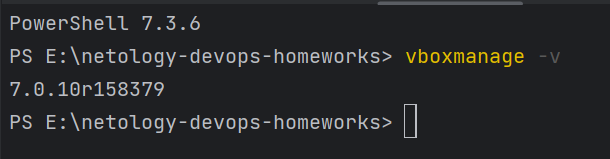
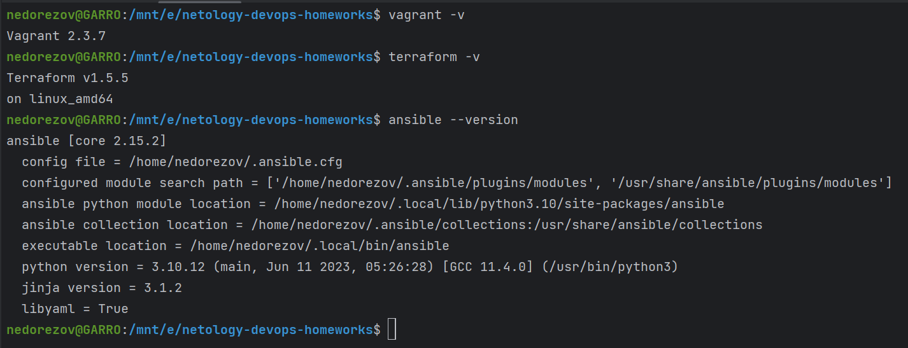
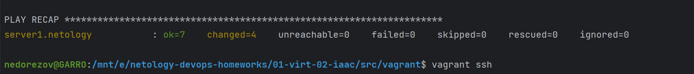
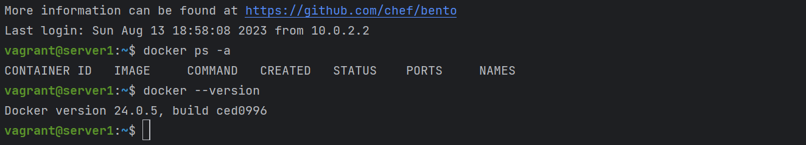

# Домашнее задание к занятию "Применение принципов IaaC в работе с виртуальными машинами" - `Александр Недорезов`

### Задача 1
- Опишите основные преимущества применения на практике IaaC-паттернов.
- Какой из принципов IaaC является основополагающим?


> #### Ответ:
> Преимущества IaaC-паттернов: 
> - **Скорость и уменьшение затрат.** IaaC позволяет быстрее конфигурировать инфраструктуру и направлен на обеспечение 
> прозрачности, чтобы помочь другим командам со всего предприятия работать быстрее и эффективнее. 
> Это освобождает дорогостоящие ресурсы команды для выполнения других важных задач.  
> - **Масштабируемость и стандартизация.** IaaC предоставляет стабильные среды быстро и на должном уровне. 
> Командам разработчиков не нужно прибегать к ручной настройке - они обеспечивают корректность, описывая с помощью 
> кода требуемое состояние сред. Развертывания инфраструктуры с помощью IaaC повторяемы и предотвращают 
> проблемы во время выполнения, вызванных дрейфом конфигурации или отсутствием зависимостей. 
> IaaC полностью стандартизирует сетап инфраструктуры, что снижает вероятность ошибок или отклонений.  
> - **Безопасность и документация.** Если за провизионирование всех вычислительных, сетевых и служб хранения 
> отвечает код, они каждый раз будут развертываться одинаково. Это означает, что стандарты безопасности можно 
> легко и последовательно применять в разных компаниях. IaaC также служит некой формой документации о правильном 
> способе создания инфраструктуры и страховкой на случай, если сотрудники покинут вашу компанию, обладая важной 
> информацией. Поскольку код можно версионировать, IaaC позволяет документировать, регистрировать и отслеживать 
> каждое изменение конфигурации вашего сервера.  
> - **Снижение рисков, быстрое восстановление в аварийных ситуациях,** что частично следует из предыдущего пункта. Например, IaaC может продублировать последнее работоспособное состояние после сбоя, 
> т.к. отслеживает инфраструктуру. Все файлы конфигураций наравне с прочими файлами исходного программного кода попадают 
> под контроль систем управления версиями. Вероятность появления каких-либо ошибок значительно снижается, ведь IaC всецело стандартизирует сетап инфраструктуры.
> 
> Основополагающий принцип IaaC - **идемпотентность**, т.е. свойство объекта или операции при повторном применении операции 
> к объекту давать тот же результат, что и при первом.

---

### Задача 2
- Чем Ansible выгодно отличается от других систем управление конфигурациями?
- Какой, на ваш взгляд, метод работы систем конфигурации более надёжный — push или pull?


> #### Ответ:
> Чем Ansible выгодно отличается:
> - **Безагентная модель работы** - Ansible устанавливается на Linux-контроллер, и ему нужна лишь возможность 
> подключиться к таргету по ssh/winrm, и для выполнения команд Python на Linux и vbs/powershell на windows
> - **Расширяемость** - Ansible создан на Python, и при необходимости на нём всегда можно легко написать новые модули. 
> Также существует коммьюнити, обширное количество модулей и готовых ролей в Ansible Galaxy
> - **Низкий порог вхождения** - Ansible прост, YAML-плейбуки просты и читаемы, ко всем модулям подробная документация, 
> и разобраться с написанием простейших плейбуков достаточно легко. Однако за внешней простотой Ansible скрываются очень 
> мощные функциональные возможности. 
> - **Поддержка push и pull-методов** - выполнение всех сценариев и команд в Ansible происходит методом Push. При необходимости 
> осуществляется запуск сценария и последовательное его выполнение на удаленных серверах. Но создатели позаботились о 
> возможности использования метода pull. С этой целью был написан специальный модуль для установки части программного решения на удаленные хосты.
> 
> Push или Pull:  
> У каждого метода есть свои плюсы и минусы. Некоторые задачи легче осуществить с одним и сложнее — с другим, ну а при построении более сложных систем используется гибридный метод. 
> В «pull» системе клиенты связываются с сервером независимо друг от друга, поэтому система в целом более масштабируема, чем «push» система, в которой должна быть полная модель всей архитектуры на центральном контроллер-узле. 
> Считается, что pull безопаснее, поскольку учетные данные кластера недоступны за его пределами, но на мой взгляд в любой зрелой инфраструктуре для работы IaaC должен использоваться Vault для хранения секретов, и тут Push и Pull уже будут равны.  
> Однако я бы выбрал «push» при условии, что управляющий кластер максимально будет защищён от несанкционированного доступа. 
> Он в какой-то мере надёжней, т.к. централизованно управляет конфигурацией и исключает ситуации, когда прямое изменение 
> на сервере не отразится в репозитории, что может привести к непредсказуемым ситуациям. 
> 
---

### Задача 3
Установите на личный компьютер:

- [VirtualBox](https://www.virtualbox.org/),
- [Vagrant](https://github.com/netology-code/devops-materials),
- [Terraform](https://github.com/netology-code/devops-materials/blob/master/README.md),
- Ansible.

*Приложите вывод команд установленных версий каждой из программ, оформленный в Markdown.*

> #### Ответ:
> Я пошел по тернистому пути :)
> VirtualBox установлен на Windows, а vagrant, terraform и ansible в WSL2 Ubuntu 
>   
>   
> Пришлось помучиться с настройкой:
> - чтобы vagrant видел virtualbox
>   - плагин virtualbox_WSL2
>   - разрешить в Windows Firewall для Virtualbox частную сеть
>   - добавить переменные окружения по [доке](https://developer.hashicorp.com/vagrant/docs/other/wsl)
> - настройкой сети для openvpn-туннеля c windows - [рекомендации](https://learn.microsoft.com/ru-ru/windows/wsl/troubleshooting#common-issues)
>   - отрубить генерацию resolv.conf ("generateResolvConf=false" в wsl.conf)
>   - создать resolv.conf, добавить DNS адрес "nameserver 8.8.8.8"
> - пофиксить проблему с ssh ключами - [тут](https://github.com/geerlingguy/ansible-for-devops/issues/234)
>
> , но, в итоге все получилось.

---

### Задача 4
Воспроизведите практическую часть лекции самостоятельно.

- Создайте виртуальную машину.
- Зайдите внутрь ВМ, убедитесь, что Docker установлен с помощью команды
```
docker ps,
```
Vagrantfile из лекции и код ansible находятся в [папке](https://github.com/netology-code/virt-homeworks/tree/virt-11/05-virt-02-iaac/src).

*Приложите скриншоты в качестве решения на эту задачу.*


> #### Ответ:
> Результат создания ВМ и provision:
>   
> Подключился к ВМ, проверил Docker:
>   

---