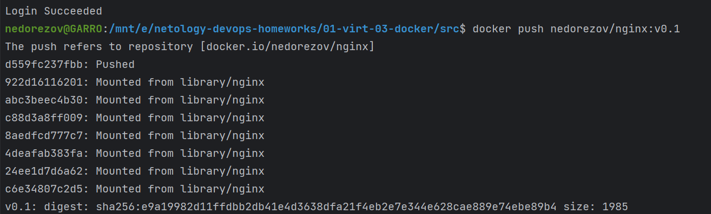
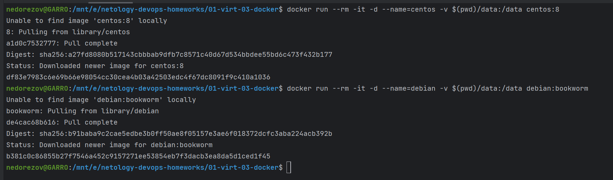
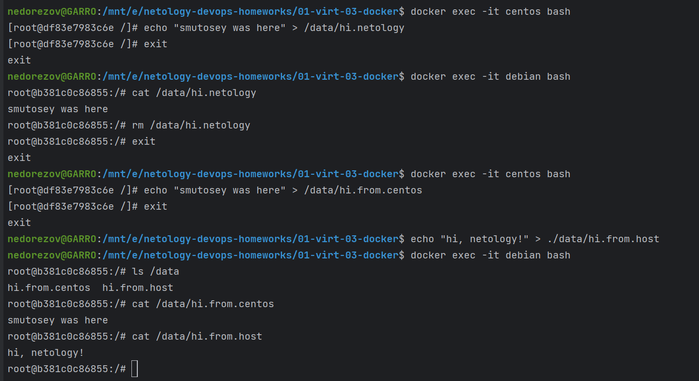

# Домашнее задание к занятию "Введение. Экосистема. Архитектура. Жизненный цикл Docker-контейнера" - `Александр Недорезов`

### Задача 1
Сценарий выполнения задачи:

- создайте свой репозиторий на https://hub.docker.com;
- выберите любой образ, который содержит веб-сервер Nginx;
- создайте свой fork образа;
- реализуйте функциональность:
запуск веб-сервера в фоне с индекс-страницей, содержащей HTML-код ниже:
```
<html>
<head>
Hey, Netology
</head>
<body>
<h1>I’m DevOps Engineer!</h1>
</body>
</html>
```

Опубликуйте созданный fork в своём репозитории и предоставьте ответ в виде ссылки на https://hub.docker.com/username_repo.

> #### Ответ:
> [Dockerfile для сборки образа](build/Dockerfile)  
> Пуш образа в DockerHub:  
>   
> 
> Ссылка на репозиторий: [hub.docker.com/r/nedorezov/nginx](https://hub.docker.com/r/nedorezov/nginx)

---

### Задача 2
Посмотрите на сценарий ниже и ответьте на вопрос:
«Подходит ли в этом сценарии использование Docker-контейнеров или лучше подойдёт виртуальная машина, физическая машина? Может быть, возможны разные варианты?»

Детально опишите и обоснуйте свой выбор.

--

> #### Ответ:
> - **Высоконагруженное монолитное Java веб-приложение** 
>   - Лучше использовать ВМ. Контейнеризация подойдет больше для микросервисов, здесь она будет излишней. Незачем обертывать приложение в контейнер, если его толком не получится масштабировать или перенести без простоя. Физические сервера - ну, в современных инфраструктурах не очень актуально, дорого.
> - **Nodejs веб-приложение**
>   - Отлично подойдет запуск в виде Docker-контейнера. Это backend, поэтому будет критически важно его масштабировать, сделать отказоустойчивым, а значит и контейнеризация и/или оркестрация необходимы
> - **Мобильное приложение c версиями для Android и iOS**
>   - Если речь про бэкенд, с которым обзаются по API, то проще использовать контейнеры, чтобы опять же масштабировать. Если это что-то с UI - наверное, ВМ. Для тестирования различных версий, сборки в CI/CD - контейнеры.
> - **Шина данных на базе Apache Kafka** 
>   - Зависит от нагруженности. Для малых и средних кластеров для простоты деплоя выгоднее использовать контейнеризацию. Оркестрация позволит автоматически масштабировать кластер в зависимости от нагрузки, сделать отказоустойчивым. Но контейнеризация вроде как может негативно влиять на скорость I/O-операций, и в случае особо повышенных требований к скорости стоит использовать ВМ, например, от трёх виртуалок с Kafka, объединенные в кластер KRaft.
> - **Elasticsearch-кластер для реализации логирования продуктивного веб-приложения — три ноды elasticsearch, два logstash и две ноды kibana**
>   - Контейнеризация подойдёт лучше, удобнее для кластеризации, у контейнеров меньше оверхед. Но для распределенного кластера понадобится оркестрация, либо просто каждая нода = виртуалка.
> - **Мониторинг-стек на базе Prometheus и Grafana** 
>   - Небольшие сервисы, удобно поднять в контейнерах. Снова про масштабирование, в случае использования долгосрочного хранилища метрик оно может понадобиться, да и Prometheus обычно работают в паре. Но экспортеры лучше поднимать на хостах, а не в докере, чтобы иметь возможность собирать метрики ноды напрямую.
> - **MongoDB как основное хранилище данных для Java-приложения** 
>   - Mongodb отлично работает в контейнере, просто данные монтируем в виде volume. Можно java-приложение развернуть в соседнем контейнере.
> - **Gitlab-сервер для реализации CI/CD-процессов и приватный (закрытый) Docker Registry**
>   - Можно на виртуалках, но проще контейнеры. Удобно будет gitlab-раннеры поднять в соседних контейнерах, и использовать docker executor для выполнения (без DinD, рядом)- внедрили у себя на работе, очень гибко и удобно, работает стабильно. Также проще обновить docker-gitlab, т.к. в omnibus версии gitlab микросервисный, и обновляться надо аккуратнее. Также Registry можно организовать прямо в GitLab, либо рядом поднять Nexus.


---

### Задача 3
- Запустите первый контейнер из образа ***centos*** c любым тегом в фоновом режиме, подключив папку ```/data``` из текущей рабочей директории на хостовой машине в ```/data``` контейнера.
- Запустите второй контейнер из образа ***debian*** в фоновом режиме, подключив папку ```/data``` из текущей рабочей директории на хостовой машине в ```/data``` контейнера.
- Подключитесь к первому контейнеру с помощью ```docker exec``` и создайте текстовый файл любого содержания в ```/data```.
- Добавьте ещё один файл в папку ```/data``` на хостовой машине.
- Подключитесь во второй контейнер и отобразите листинг и содержание файлов в ```/data``` контейнера.


> #### Ответ:
> Запуск контейнеров с примонтированной директорией:   
>   
> Манипуляции с volume dir:  
>   
---

### Задача 4*
Воспроизведите практическую часть лекции самостоятельно.

Соберите Docker-образ с Ansible, загрузите на Docker Hub и пришлите ссылку вместе с остальными ответами к задачам.


> #### Ответ:
> Сборка в каталоге [build_repeat](build_repeat)  
> Ссылка на опубликованный репозиторий: [hub.docker.com/r/nedorezov/ansible/tags](https://hub.docker.com/r/nedorezov/ansible/tags)
> 

---