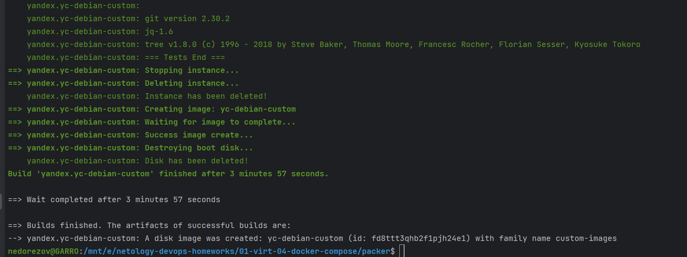
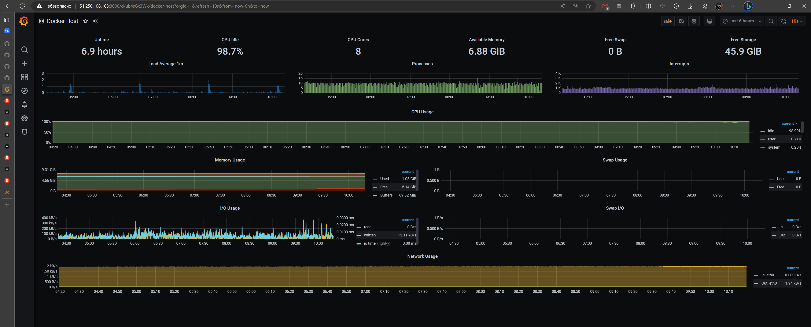

# Домашнее задание к занятию "" - `Александр Недорезов`

### Задача 1
Создайте собственный образ любой операционной системы (например, debian-11) с помощью Packer версии 1.5.0 ([инструкция](https://cloud.yandex.ru/docs/tutorials/infrastructure-management/packer-quickstart)).

Чтобы получить зачёт, вам нужно предоставить скриншот страницы с созданным образом из личного кабинета YandexCloud.

> #### Ответ:
> Создал конфигурационный файл в формате HCL - [debian.custom.pkr.hcl](packer/debian.custom.pkr.hcl)
> Сборка образа:
> 
> 
> Скриншот из консоли управления Yandex Cloud:
> 

---

### Задача 2
**2.1.** Создайте вашу первую виртуальную машину в YandexCloud с помощью web-интерфейса YandexCloud.        

**2.2.*** **(Необязательное задание)**  
Создайте вашу первую виртуальную машину в YandexCloud с помощью Terraform (вместо использования веб-интерфейса YandexCloud).
Используйте Terraform-код в директории ([terraform](terraform)).

Чтобы получить зачёт, вам нужно предоставить вывод команды terraform apply и страницы свойств, созданной ВМ из личного кабинета YandexCloud.

> #### Ответ:
> Создал ВМ с помощью Terraform. Скорректировал конфиги в [terraform](terraform), добавил использование tfvars.  
> Запуск terraform apply:
> 
> 
> Созданная нода в Yandex Cloud
> 

---

### Задача 3
С помощью Ansible и Docker Compose разверните на виртуальной машине из предыдущего задания систему мониторинга на основе Prometheus/Grafana.
Используйте Ansible-код в директории ([ansible](ansible)).

Чтобы получить зачёт, вам нужно предоставить вывод команды "docker ps", все контейнеры, описанные в [docker-compose](ansible/stack/docker-compose.yaml), должны быть в статусе "Up".

> #### Ответ:
> Переработал файлы [provision.yml](ansible/provision.yml) и [inventory.yml](ansible/inventory.yml), 
> актуализировал таски под собственный образ, а также разделил их по группам хостов.  
> Результат запуска: 
> 
---

### Задача 4
1. Откройте веб-браузер, зайдите на страницу http://<внешний_ip_адрес_вашей_ВМ>:3000.
2. Используйте для авторизации логин и пароль из [.env](ansible/stack/.env).
3. Изучите доступный интерфейс, найдите в интерфейсе автоматически созданные docker-compose-панели с графиками([dashboards](https://grafana.com/docs/grafana/latest/dashboards/use-dashboards/)).
4. Подождите 5-10 минут, чтобы система мониторинга успела накопить данные.

Чтобы получить зачёт, предоставьте:
- скриншот работающего веб-интерфейса Grafana с текущими метриками

> #### Ответ:
> 

---

### Задача 5 (*)
Создайте вторую ВМ и подключите её к мониторингу, развёрнутому на первом сервере.

Чтобы получить зачёт, предоставьте:
- скриншот из Grafana, на котором будут отображаться метрики добавленного вами сервера.

> #### Ответ:

---