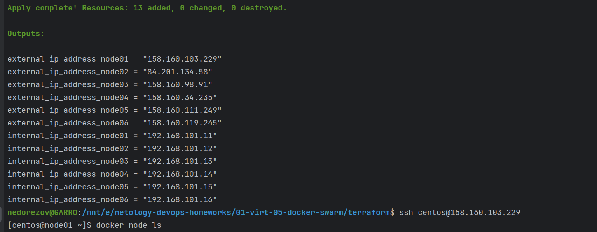
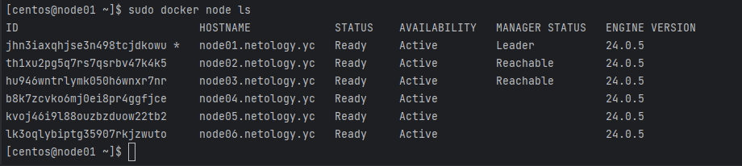
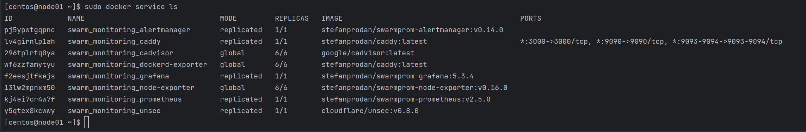
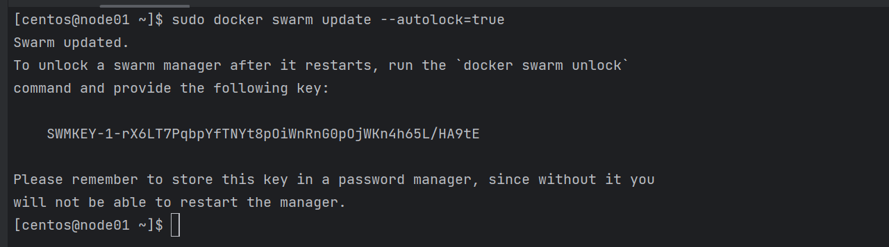

# Домашнее задание к занятию "Оркестрация кластером Docker контейнеров на примере Docker Swarm" - `Александр Недорезов`

### Задача 1
Дайте письменные ответы на вопросы:

- В чём отличие режимов работы сервисов в Docker Swarm-кластере: replication и global?
> #### Ответ:
> **Replicated** - сервис запускается в кластере с заданным количеством реплик. указываете, сколько идентичных задач хотите запустить. 
> Например, сервис HTTP с тремя репликами, каждая из которых обслуживает один и тот же контент.  
> **Global** - это сервис, который запускает одну задачу на каждой ноде. 
> Предварительно заданного количества задач нет. Каждый раз, когда вы добавляете ноду в swarm, 
> оркестратор создает задачу, а планировщик назначает задачу новой ноде. Обычно это агенты мониторинга, антивирусные сканеры и т.д.

- Какой алгоритм выбора лидера используется в Docker Swarm-кластере?
> #### Ответ:
> Используется [Raft](https://raft.github.io/) - алгоритм поддержания распределенного консенсуса. 
> Выбор лидера происходит следующим образом: если ноды-фолловеры не слышат лидера, они переходят в статус кандидата, кандидат на лидера отправляет остальным нодам запрос на голосование и, большинством голосов, выбирается лидером.

- Что такое Overlay Network?
> #### Ответ:
> Overlay Network - распределенная сеть среди нескольких хостов Docker. 
> Эта сеть перекрывает остальные, что позволяет контейнерам, подключенным к ней (включая сервисные контейнеры swarm), 
> безопасно обмениваться данными при включенном шифровании. Docker прозрачно обрабатывает маршрутизацию каждого пакета 
> от и к правильному хосту демона Docker и правильному контейнеру назначения.
> Сеть типа overlay требует, чтобы хост был частью сети Swarm. В Swarm по умолчанию используется overlay-сеть с именем 
> ingress для распределения нагрузки, а так же сеть типа bridge с названием docker_gwbridge для коммуникации самих Docker daemon.
> 
> Для overlay сетей есть так же требования к доступным портам на фаерволе:
> - TCP 2377 для коммуникации менеджмента кластера;
> - TCP и UDP 7946 для коммуникации нод кластера;
> - UDP 4789 для трафика сети overlay.

---

### Задача 2
Создайте ваш первый Docker Swarm-кластер в Яндекс Облаке.

Чтобы получить зачёт, предоставьте скриншот из терминала (консоли) с выводом команды:
```
docker node ls
```

> #### Ответ:
> Развернул кластер через Terraform:
> 
> Проверка доступности нод:
> 

---

### Задача 3
Создайте ваш первый, готовый к боевой эксплуатации кластер мониторинга, состоящий из стека микросервисов.

Чтобы получить зачёт, предоставьте скриншот из терминала (консоли), с выводом команды:
```
docker service ls
```

> #### Ответ:
> Запущенные сервисы в кластере:
> 

---

### Задача 4 (*)
Выполните на лидере Docker Swarm-кластера команду, указанную ниже, и дайте письменное описание её функционала — что она делает и зачем нужна:
```
# см.документацию: https://docs.docker.com/engine/swarm/swarm_manager_locking/
docker swarm update --autolock=true
```

> #### Ответ:
> Команда `docker swarm update` конфигурирует кластер Swarm и `--autolock=true` включает автоматическую блокировку.  
> 
> Блокировка позволяет закрыть риски безопасности: 
> например, перезапуск менеджер-ноды или восстановление бэкапа потенциально могут привести к компрометации кластера, 
> т.к. менеджеры, повторно присоединяющиеся к swarm, автоматически расшифровывают и получают доступ к базе данных 
> временных рядов журнала Raft, а восстановление бэкапа также может привести к удалению текущей конфигурации кластера Swarm.  
> Блокировка вынуждает менеджеров предъявлять ключ разблокировки, прежде чем они будут допущены обратно в кластер.

---