# Домашнее задание к занятию "SQL" - `Александр Недорезов`

### Задача 1
Используя Docker, поднимите инстанс PostgreSQL (версию 12) c 2 volume, 
в которые будут складываться данные БД и бэкапы.

Приведите получившуюся команду или docker-compose-манифест.


> #### Ответ:
> Составил файл [docker-compose.yml](docker-compose.yml), в качестве volume также добавил каталог со скриптами инициализации.
> Результат: 
> 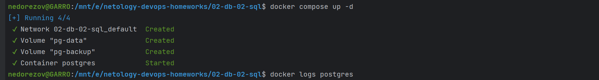
> 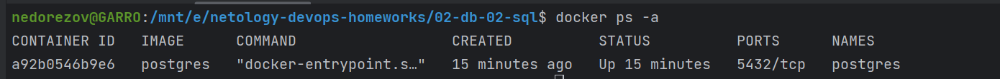

---

### Задача 2
В БД из задачи 1: 

- создайте пользователя test-admin-user и БД test_db;
- в БД test_db создайте таблицу orders и clients (спeцификация таблиц ниже);
- предоставьте привилегии на все операции пользователю test-admin-user на таблицы БД test_db;
- создайте пользователя test-simple-user;
- предоставьте пользователю test-simple-user права на SELECT/INSERT/UPDATE/DELETE этих таблиц БД test_db.

Таблица orders:

- id (serial primary key);
- наименование (string);
- цена (integer).

Таблица clients:

- id (serial primary key);
- фамилия (string);
- страна проживания (string, index);
- заказ (foreign key orders).

Приведите:

- итоговый список БД после выполнения пунктов выше;
- описание таблиц (describe);
- SQL-запрос для выдачи списка пользователей с правами над таблицами test_db;
- список пользователей с правами над таблицами test_db.


> #### Ответ:
> Итоговый список БД после выполнения [скрипта](initdb/entrypoint.sql) инициализации:
> 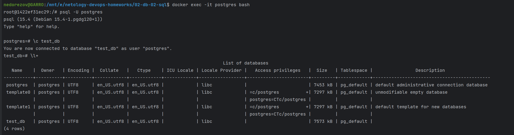
> Describe таблиц:
> 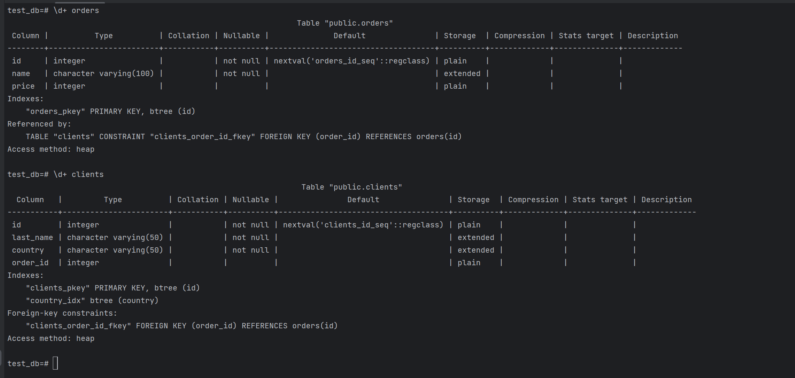
> SQL-запрос для выдачи списка пользователей с правами над таблицами test_db:  
> `SELECT table_name, grantee, privilege_type FROM information_schema.role_table_grants WHERE grantee not in ('postgres') and table_name in ('orders', 'clients');`  
> Список пользователей с правами над таблицами test_db:  
> 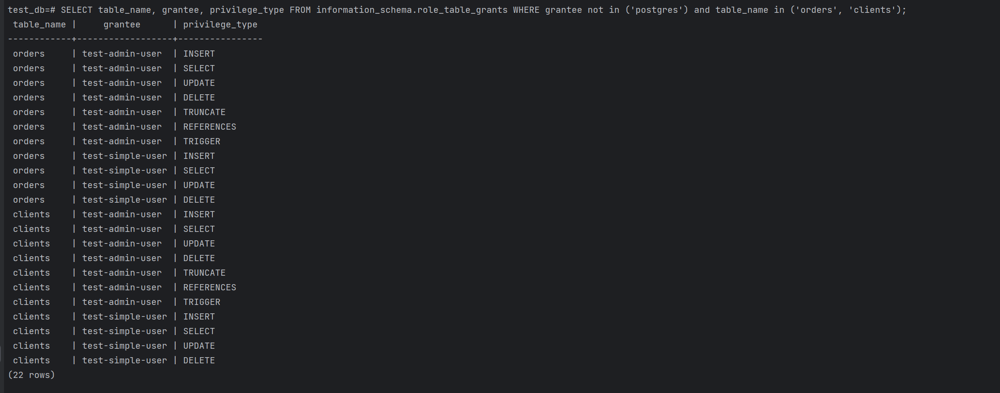
---

### Задача 3
Используя SQL-синтаксис, наполните таблицы следующими тестовыми данными:  

Таблица orders

|Наименование|цена|
|------------|----|
|Шоколад| 10 |
|Принтер| 3000 |
|Книга| 500 |
|Монитор| 7000|
|Гитара| 4000|

Таблица clients  

|ФИО|Страна проживания|
|------------|----|
|Иванов Иван Иванович| USA |
|Петров Петр Петрович| Canada |
|Иоганн Себастьян Бах| Japan |
|Ронни Джеймс Дио| Russia|
|Ritchie Blackmore| Russia|

Используя SQL-синтаксис:  
- вычислите количество записей для каждой таблицы.

Приведите в ответе:  
- запросы,
- результаты их выполнения.

> #### Ответ:
> SQL-запросы приведены в [task3.sql](initdb/task3.sql)  
> Insert данных в таблицы:
> ```sql
> INSERT INTO orders (name, price)
> VALUES
>     ('Шоколад','10'),
>     ('Принтер','3000'),
>     ('Книга','500'),
>     ('Монитор','7000'),
>     ('Гитара','4000');
> 
> INSERT INTO clients (last_name, country)
> VALUES
>     ('Иванов Иван Иванович','USA'),
>     ('Петров Петр Петрович','Canada'),
>     ('Иоганн Себастьян Бах','Japan'),
>     ('Ронни Джеймс Дио','Russia'),
>     ('Ritchie Blackmore','Russia');
> ```
> 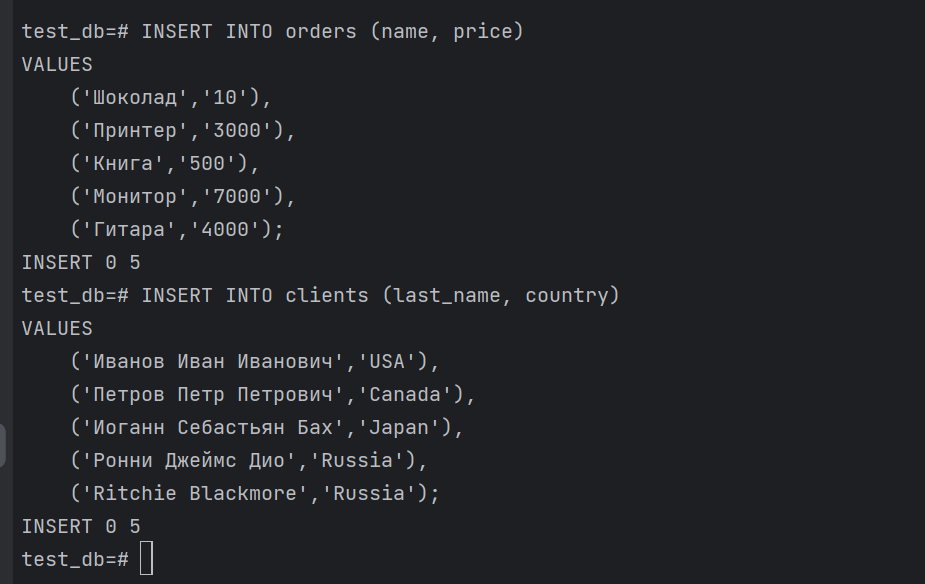
> Выборка количества записей в таблицах: 
> ```sql
> SELECT count(*) FROM orders;
> SELECT count(*) FROM clients;
> ```
> 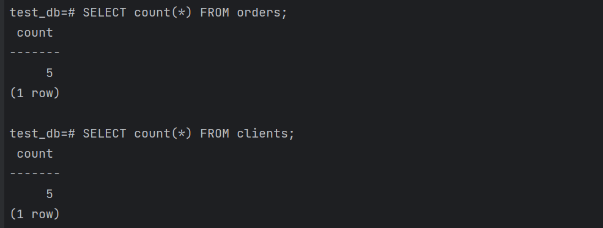

---

### Задача 4
Часть пользователей из таблицы clients решили оформить заказы из таблицы orders.

Используя foreign keys, свяжите записи из таблиц, согласно таблице:

|ФИО|Заказ|
|------------|----|
|Иванов Иван Иванович| Книга |
|Петров Петр Петрович| Монитор |
|Иоганн Себастьян Бах| Гитара |

Приведите SQL-запросы для выполнения этих операций.

Приведите SQL-запрос для выдачи всех пользователей, которые совершили заказ, а также вывод этого запроса.
 
Подсказка: используйте директиву `UPDATE`.


> #### Ответ:
> SQL-запросы приведены в [task4.sql](initdb/task4.sql)  
> Апдейт таблицы: 
> ```sql
> UPDATE clients SET order_id=(SELECT id FROM orders WHERE name='Книга') WHERE last_name='Иванов Иван Иванович';
> UPDATE clients SET order_id=(SELECT id FROM orders WHERE name='Монитор') WHERE last_name='Петров Петр Петрович';
> UPDATE clients SET order_id=(SELECT id FROM orders WHERE name='Гитара') WHERE last_name='Иоганн Себастьян Бах';
> ```
> 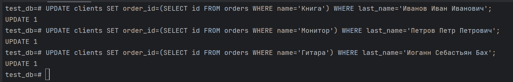
> Выборка всех пользователей, которые совершили заказ:
> ```sql
> SELECT * FROM clients WHERE order_id IS NOT NULL;
> ```
> 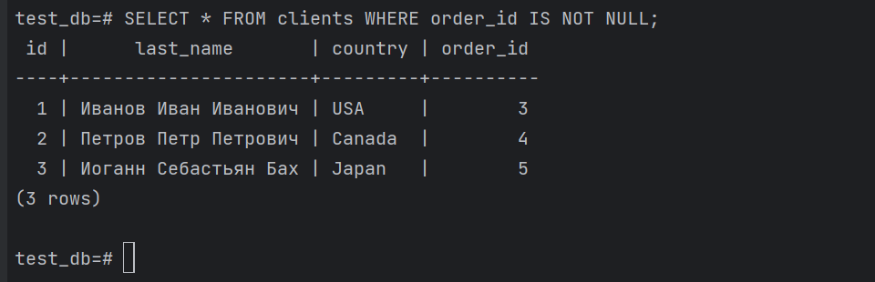

---

### Задача 5
Получите полную информацию по выполнению запроса выдачи всех пользователей из задачи 4 
(используя директиву EXPLAIN).

Приведите получившийся результат и объясните, что значат полученные значения.


> #### Ответ:
> Выполнение EXPLAIN:
> 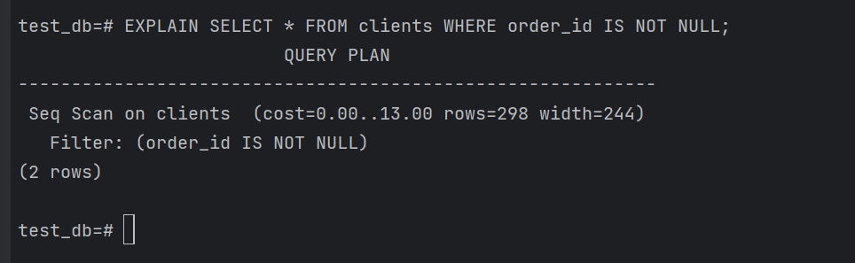
> - `Seq Scan` - используется последовательное чтение данных таблицы
> - `cost` - затратность операции
>   - `0.00` - затраты на получение первой строки
>   - `13.00` - затраты на получение всех строк
> - `rows` - приблизительное количество возвращаемых строк при выполнении операции `Seq Scan`
> - `width` - средний размер одной строки в байтах

---

### Задача 6
Создайте бэкап БД test_db и поместите его в volume, предназначенный для бэкапов (см. задачу 1).  
Остановите контейнер с PostgreSQL, но не удаляйте volumes.  
Поднимите новый пустой контейнер с PostgreSQL.  
Восстановите БД test_db в новом контейнере.  
Приведите список операций, который вы применяли для бэкапа данных и восстановления.   


> #### Ответ:
> Создаем бэкап БД с помощью pg_dump, а также дамп ролей с помощью pg_dumpall (т.к. pg_dump не умеет)
> ```sql
> pg_dump -U postgres -Ccd test_db > /pg-backup/test_db.dump
> pg_dumpall --roles-only -U postgres > /pg-backup/roles.dump
> ```
> В бэкапе БД учтем ключи:
> - -С: включает в дамп команду на создание БД 
> - -с: drop объектов перед созданием (по хардкору)  
> 
> Вместо остановки текущего контейнера, создадим новый рядом, с отдельным volume для data (назовем data-2), а backup тот же. 
> Дописал [docker-compose.yml](docker-compose.yml), результат запуска: 
> 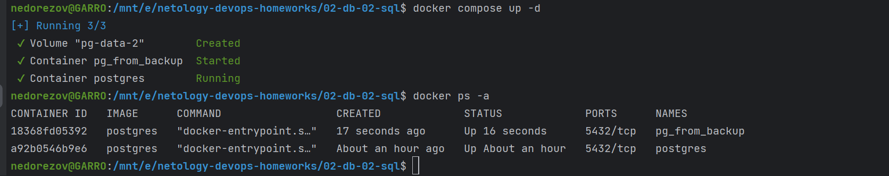
> Заходим в контейнер, запускаем восстановление ролей и БД из дампа:
> ```sql
> psql -U postgres < /pg-backup/roles.dump
> psql -U postgres < /pg-backup/test_db.dump
> ```
> 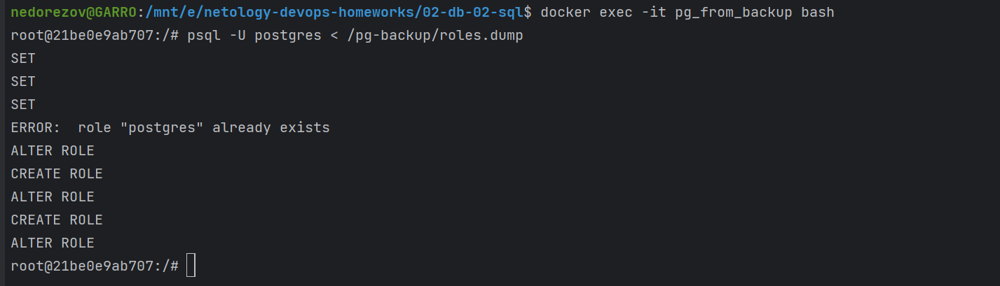
> 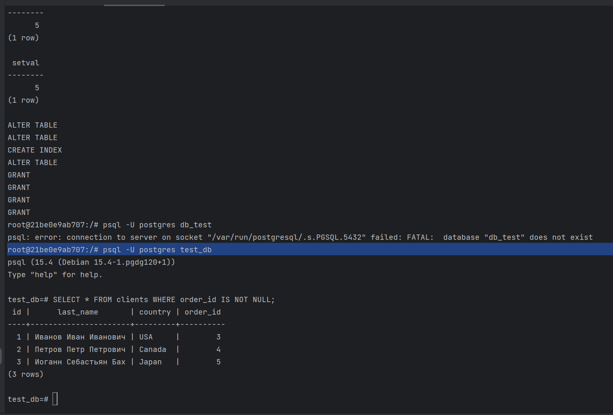
> Команды отработали успешно, доступы выданы, и в результате проверил, что в восстановленной БД данные есть.

---
