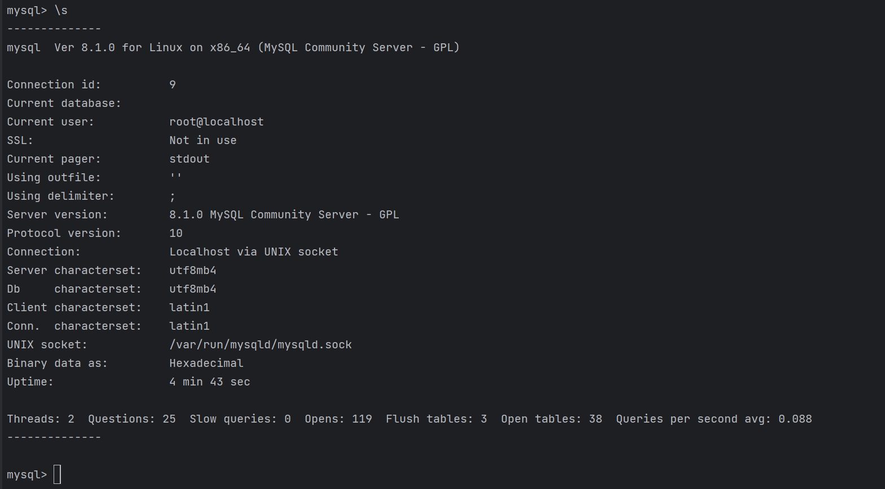

# Домашнее задание к занятию "MySQL" - `Александр Недорезов`

### Задача 1
Используя Docker, поднимите инстанс MySQL (версию 8). Данные БД сохраните в volume.

Изучите [бэкап БД](https://github.com/netology-code/virt-homeworks/tree/virt-11/06-db-03-mysql/test_data) и 
восстановитесь из него.

Перейдите в управляющую консоль `mysql` внутри контейнера.

Используя команду `\h`, получите список управляющих команд.

Найдите команду для выдачи статуса БД и **приведите в ответе** из её вывода версию сервера БД.

Подключитесь к восстановленной БД и получите список таблиц из этой БД.

**Приведите в ответе** количество записей с `price` > 300.

В следующих заданиях мы будем продолжать работу с этим контейнером.


> #### Ответ:
> Можно было восстановить бэкап вручную после поднятия контейнера, но я решил через entrypoint, просто добавив в команды
> ```sql
> CREATE DATABASE /*!32312 IF NOT EXISTS*/ `test_db` /*!40100 DEFAULT CHARACTER SET utf8 */;
> USE test_db;
> ```
> 
> В логах контейнера видно успешное выполнение:
> 
> Статус БД:
> 
> ```sql
> Server version:         8.0.33 MySQL Community Server - GPL****
> ```
> Можно также получить через `SELECT VERSION()`:
> 
> Список таблиц из БД:
> ```sql
> mysql> use test_db;
> Database changed
> mysql> SHOW TABLES;
> +-------------------+
> | Tables_in_test_db |
> +-------------------+
> | orders            |
> +-------------------+
> 1 row in set (0.00 sec)
> 
> ```
> 
> Количество записей с price>300:
> ```sql
> mysql> SELECT * FROM orders WHERE price > 300;
> +----+----------------+-------+
> | id | title          | price |
> +----+----------------+-------+
> |  2 | My little pony |   500 |
> +----+----------------+-------+
> 1 row in set (0.00 sec)
> 
> mysql>
> ```

---

### Задача 2
Создайте пользователя test в БД c паролем test-pass, используя:

- плагин авторизации mysql_native_password
- срок истечения пароля — 180 дней 
- количество попыток авторизации — 3 
- максимальное количество запросов в час — 100
- аттрибуты пользователя:
    - Фамилия "Pretty"
    - Имя "James".

Предоставьте привелегии пользователю `test` на операции SELECT базы `test_db`.
    
Используя таблицу INFORMATION_SCHEMA.USER_ATTRIBUTES, получите данные по пользователю `test` и 
**приведите в ответе к задаче**.


> #### Ответ:
> Создание пользователя `test`:
> ```sql
> mysql> CREATE USER 'test' 
>     -> IDENTIFIED WITH mysql_native_password BY 'badpassword'
>     -> WITH MAX_CONNECTIONS_PER_HOUR 100
>     -> PASSWORD EXPIRE INTERVAL 180 DAY
>     -> FAILED_LOGIN_ATTEMPTS 3
>     -> ATTRIBUTE '{"Фамилия": "Pretty", "Имя": "James"}';
> Query OK, 0 rows affected (0.01 sec)
> ```
> 
> Предоставление привелений пользователю `test` на SELECT в базе `test_db`:
> ```sql
> mysql> GRANT SELECT ON test_db.* TO test;
> Query OK, 0 rows affected (0.05 sec)
> 
> ```
> Данные по пользователю `test`:
> ```sql
> mysql> SELECT * FROM INFORMATION_SCHEMA.USER_ATTRIBUTES WHERE USER='test';
> +------+------+----------------------------------------------+
> | USER | HOST | ATTRIBUTE                                    |
> +------+------+----------------------------------------------+
> | test | %    | {"LastName": "James", "FirstName": "Pretty"} |
> +------+------+----------------------------------------------+
> 1 row in set (0.00 sec)
> 
> ```

---

### Задача 3
Установите профилирование `SET profiling = 1`.
Изучите вывод профилирования команд `SHOW PROFILES;`.

Исследуйте, какой `engine` используется в таблице БД `test_db` и **приведите в ответе**.

Измените `engine` и **приведите время выполнения и запрос на изменения из профайлера в ответе**:
- на `MyISAM`,
- на `InnoDB`.


> #### Ответ:
> Установил `SET profiling = 1`.  
> В данных по таблице `orders` видно, что используется движок InnoDB:  
> ```sql
> mysql> SHOW TABLE STATUS WHERE Name = 'orders' \G;
> *************************** 1. row ***************************
>            Name: orders
>          Engine: InnoDB
>         Version: 10
>      Row_format: Dynamic
>            Rows: 5
>  Avg_row_length: 3276
>     Data_length: 16384
> Max_data_length: 0
>    Index_length: 0
>       Data_free: 0
>  Auto_increment: 6
>     Create_time: 2023-08-27 08:32:46
>     Update_time: NULL
>      Check_time: NULL
>       Collation: utf8mb4_0900_ai_ci
>        Checksum: NULL
>  Create_options:
>         Comment:
> 1 row in set (0.00 sec)
> ```
> 
> Выполнил последовательное изменение `engine` таблицы:
> ```sql
> mysql> ALTER TABLE orders ENGINE = MyISAM;
> Query OK, 5 rows affected (0.11 sec)
> Records: 5  Duplicates: 0  Warnings: 0
> 
> mysql> ALTER TABLE orders ENGINE = InnoDB;
> Query OK, 5 rows affected (0.08 sec)
> Records: 5  Duplicates: 0  Warnings: 0
> ```
> 
> В `SHOW PROFILES;` вывод профилирования запросов:
> ```sql
> mysql> SHOW PROFILES;
> +----------+------------+-----------------------------------------+
> | Query_ID | Duration   | Query                                   |
> +----------+------------+-----------------------------------------+
> |        1 | 0.04645700 | SHOW TABLE STATUS WHERE Name = 'orders' |
> |        2 | 0.00124800 | SHOW TABLE STATUS WHERE Name = 'orders' |
> |        3 | 0.10726925 | ALTER TABLE orders ENGINE = MyISAM      |
> |        4 | 0.08227150 | ALTER TABLE orders ENGINE = InnoDB      |
> +----------+------------+-----------------------------------------+
> 4 rows in set, 1 warning (0.00 sec)
> 
> ```
> 
> Для примера, вывод профилирования для запроса `ID=3` по CPU:
> ```sql
> mysql> SHOW PROFILE CPU FOR QUERY 3;
> +--------------------------------+----------+----------+------------+
> | Status                         | Duration | CPU_user | CPU_system |
> +--------------------------------+----------+----------+------------+
> | starting                       | 0.000254 | 0.000130 |   0.000124 |
> | Executing hook on transaction  | 0.000007 | 0.000003 |   0.000003 |
> | starting                       | 0.000173 | 0.000089 |   0.000085 |
> | checking permissions           | 0.000007 | 0.000003 |   0.000003 |
> | checking permissions           | 0.000049 | 0.000025 |   0.000024 |
> | init                           | 0.000079 | 0.000040 |   0.000038 |
> | Opening tables                 | 0.001656 | 0.000849 |   0.000809 |
> | setup                          | 0.001037 | 0.000531 |   0.000506 |
> | creating table                 | 0.006730 | 0.006756 |   0.000000 |
> | waiting for handler commit     | 0.000014 | 0.000013 |   0.000000 |
> | waiting for handler commit     | 0.036595 | 0.001878 |   0.000000 |
> | After create                   | 0.002025 | 0.002110 |   0.000000 |
> | System lock                    | 0.000018 | 0.000016 |   0.000000 |
> | copy to tmp table              | 0.000941 | 0.000976 |   0.000000 |
> | waiting for handler commit     | 0.000076 | 0.000076 |   0.000000 |
> | waiting for handler commit     | 0.000013 | 0.000012 |   0.000000 |
> | waiting for handler commit     | 0.000275 | 0.000290 |   0.000000 |
> | rename result table            | 0.000054 | 0.000054 |   0.000000 |
> | waiting for handler commit     | 0.025147 | 0.010157 |   0.008573 |
> | waiting for handler commit     | 0.000020 | 0.000009 |   0.000009 |
> | waiting for handler commit     | 0.002895 | 0.002013 |   0.000000 |
> | waiting for handler commit     | 0.000012 | 0.000010 |   0.000000 |
> | waiting for handler commit     | 0.017701 | 0.010391 |   0.000000 |
> | waiting for handler commit     | 0.000016 | 0.000014 |   0.000000 |
> | waiting for handler commit     | 0.001117 | 0.000355 |   0.000000 |
> | end                            | 0.006414 | 0.006666 |   0.004406 |
> | query end                      | 0.003782 | 0.002414 |   0.002291 |
> | closing tables                 | 0.000016 | 0.000007 |   0.000007 |
> | waiting for handler commit     | 0.000022 | 0.000012 |   0.000011 |
> | freeing items                  | 0.000053 | 0.000032 |   0.000031 |
> | cleaning up                    | 0.000075 | 0.000058 |   0.000055 |
> +--------------------------------+----------+----------+------------+
> 31 rows in set, 1 warning (0.00 sec)
> ```
---

### Задача 4
Изучите файл `my.cnf` в директории /etc/mysql.

Измените его согласно ТЗ (движок InnoDB):

- скорость IO важнее сохранности данных;
- нужна компрессия таблиц для экономии места на диске;
- размер буффера с незакомиченными транзакциями 1 Мб;
- буффер кеширования 30% от ОЗУ;
- размер файла логов операций 100 Мб.

Приведите в ответе изменённый файл `my.cnf`.

> #### Ответ:
> Бэкап файла: [my.cnf](mysql/config/my.cnf)  
> Т.к. он включает все конфиги из `./conf.d/`, просто добавим еще конфиг [custom.cnf](mysql/config/custom.cnf):
> ```properties
> # скорость IO важнее сохранности данных. Можно и метод O_DIRECT, но он мало где стабильно поддерживается
> # https://dev.mysql.com/doc/refman/8.0/en/optimizing-innodb-diskio.html
> innodb_flush_method = O_DSYNC
> # буфер журнала записывается и сбрасывается на диск один раз в секунду. Максимально повысит производительность, но и намного опаснее, чем значение = 2
> innodb_flush_log_at_trx_commit = 0
> 
> # хранить все таблицы в виде отдельных файлов, размер буфера значительно уменьшится и будет содержать только метаданные.
> innodb_file_per_table = ON
> # повышаем уровень компрессии за счет оверхеда CPU
> innodb_compression_level = 9
> 
> # размер буффера с незакомиченными транзакциями 1 Мб;
> innodb_log_buffer_size = 1M
> 
> # буффер кеширования 30% от ОЗУ; Также влияет на скорость I/O
> innodb_buffer_pool_size = 4620M
> 
> # размер файла логов операций 100 Мб.
> innodb_log_file_size = 100M
> ```

---