# Домашнее задание к занятию "PostgreSQL" - `Александр Недорезов`

### Задача 1
Используя Docker, поднимите инстанс PostgreSQL (версию 13). Данные БД сохраните в volume.
Подключитесь к БД PostgreSQL, используя `psql`.
Воспользуйтесь командой `\?` для вывода подсказки по имеющимся в `psql` управляющим командам.  

**Найдите и приведите** управляющие команды для:
- вывода списка БД,
- подключения к БД,
- вывода списка таблиц,
- вывода описания содержимого таблиц,
- выхода из psql.

> #### Ответ:
> Запуск БД через [docker-compose.yml](docker-compose.yml).  
> В инструкции сразу прописал восстановление бэкапа из задачи 2 через entrypoint, добавив в дамп команды: 
> ```sql
> CREATE DATABASE test_database;
> \connect test_database;
> ```
> Выполнение команд в psql:
> - Вывод списка БД:
> 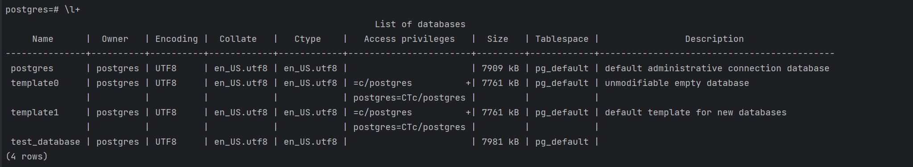
> - подключения к БД:  
> 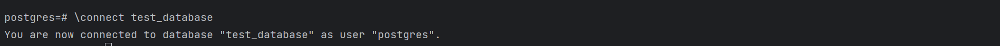
> - вывода списка таблиц:  
> 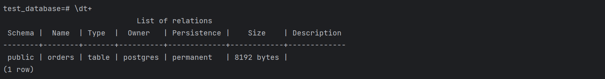
> - вывода описания содержимого таблиц:  
> 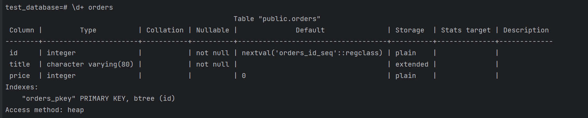
> - выхода из psql:  
> 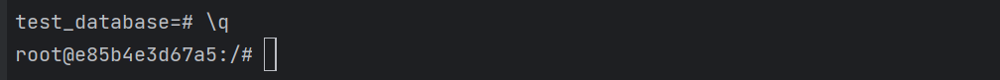


---

### Задача 2
Используя `psql`, создайте БД `test_database`.  
Изучите [бэкап БД](https://github.com/netology-code/virt-homeworks/tree/virt-11/06-db-04-postgresql/test_data).  
Восстановите бэкап БД в `test_database`.  
Перейдите в управляющую консоль `psql` внутри контейнера.  
Подключитесь к восстановленной БД и проведите операцию ANALYZE для сбора статистики по таблице.  
Используя таблицу [pg_stats](https://postgrespro.ru/docs/postgresql/12/view-pg-stats), найдите столбец таблицы `orders` 
с наибольшим средним значением размера элементов в байтах.

**Приведите в ответе** команду, которую вы использовали для вычисления, и полученный результат.


> #### Ответ:
> Восстановление [бэкапа](postgresql/backup/test_dump.sql) выполнил через entrypoint.  
> Подключился к БД и выполнил ANALYZE:  
> 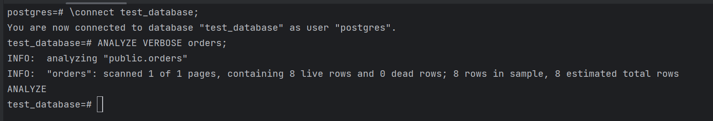  
> Далее выборкой из pg_stats находим столбец таблицы `orders` 
> с наибольшим средним значением размера элементов в байтах (т.е. avg_width - Average width in bytes of column's entries):
> ```sql
> SELECT tablename, attname, avg_width FROM pg_stats WHERE tablename = 'orders' ORDER BY avg_width DESC LIMIT 1;
> ```
> 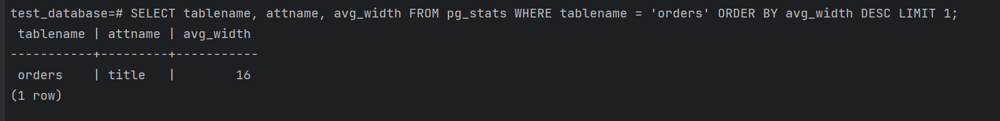
> Им оказывается столбец `title`

---

### Задача 3
Архитектор и администратор БД выяснили, что ваша таблица orders разрослась до невиданных размеров и
поиск по ней занимает долгое время. Вам как успешному выпускнику курсов DevOps в Нетологии предложили
провести разбиение таблицы на 2: шардировать на orders_1 - price>499 и orders_2 - price<=499.

Предложите SQL-транзакцию для проведения этой операции.

Можно ли было изначально исключить ручное разбиение при проектировании таблицы orders?


> #### Ответ:
> Можно применить новый подход declarative, либо старый - Partitioning Using Inheritance.
> Минус декларативного в том, что нужно перенести данные из старой таблицы и дропнуть её, что означает простой системы, но зато он быстрее работает с данными.
> Старый метод через наследование вносит путаницу в ID таблицы, т.к. select будет происходить из всех сразу, и нужно избежать дублирования данных.
> 
> Реализовал через декларативный метод:
> ```sql
> BEGIN;
> 
> -- создаем новую партицированную таблицу
> CREATE TABLE public.orders_partitioned (
>     id integer NOT NULL DEFAULT nextval('public.orders_id_seq'::regclass),
>     title character varying(80) NOT NULL,
>     price integer DEFAULT 0
> )
> PARTITION BY RANGE (price); 
> 
> -- партиция orders_1 с price>499
> CREATE TABLE public.orders_1 PARTITION OF public.orders_partitioned FOR VALUES FROM (499) TO (MAXVALUE);
> 
> -- партиция orders_2 с price<=499
> CREATE TABLE public.orders_2 PARTITION OF public.orders_partitioned FOR VALUES FROM (MINVALUE) TO (499);
> 
> -- на всякий случай перенаправляем insert
> CREATE RULE rule_orders AS ON INSERT TO orders
> DO INSTEAD INSERT INTO orders_partitioned VALUES (NEW.*);
> 
> -- копируем данные в новую таблицу
> INSERT INTO orders_partitioned (id, title, price) (SELECT id, title, price FROM orders);  
> 
> -- переносим sequence, удаляем старую таблицу
> ALTER SEQUENCE public.orders_id_seq OWNED BY public.orders_partitioned.id;
> DROP TABLE orders; 
> 
> -- меняем название
> ALTER TABLE orders_partitioned RENAME TO orders; 
> 
> -- Создаем индекс на id
> CREATE INDEX orders_pkey ON orders (id);
> 
> END;
> ```
> Проверим вставку новых значений в orders, исследуем селектами:
> 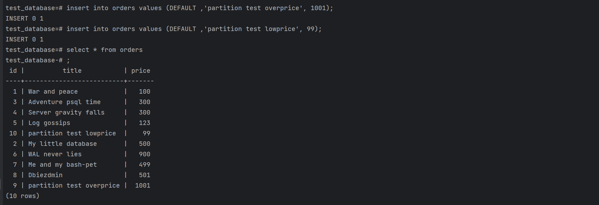
> 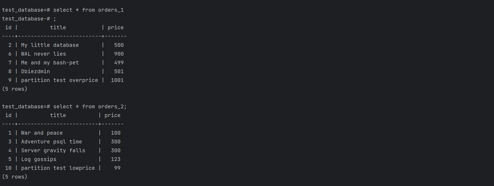
> В `EXPLAIN ANALYZE` видно, как идет выборка с использованием партиций:
> 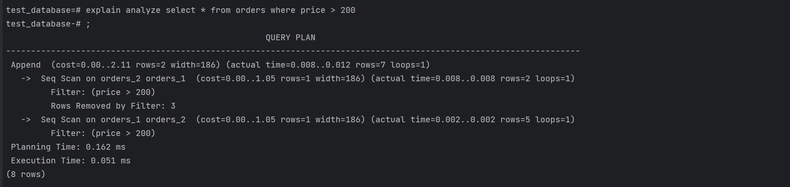
> 
> BONUS: Альтернативный метод через наследование
> ```sql
> BEGIN;
> CREATE TABLE orders_1 (CHECK (price <= 499)) INHERITS (orders);
> CREATE TABLE orders_2 (CHECK (price > 499)) INHERITS (orders);
> 
> --это внесет дубли, т.е. может и не надо переносить старые данные, либо очищать в первой таблице
> INSERT INTO orders_1 (title, price) (SELECT title, price FROM orders WHERE price <= 499);
> INSERT INTO orders_2 (title, price) (SELECT title, price FROM orders WHERE price > 499);
> 
> CREATE RULE rule_orders_1 AS ON INSERT TO orders WHERE (price <= 499) 
> DO INSTEAD INSERT INTO orders_1 VALUES (NEW.*);
> 
> CREATE RULE rule_orders_2 AS ON INSERT TO orders WHERE (price > 499) 
> DO INSTEAD INSERT INTO orders_2 VALUES (NEW.*);
> END;
> ```
> 
> Можно было изначально спроектировать декларативное партиционирование: основная таблица "секционированная" и не заполняется даннными. 
> Данные пишутся сразу в заранее подготовленные партиции. Автоматическое создание партиций можно делать через pg_partman, либо cron-джобом.  
> На мой взгляд, лучший вариант - создать `TRIGGER` на Insert в таблицу orders, который будет вызывать функцию создания партиции при превышении значения, например, id.  
> Пример:
> 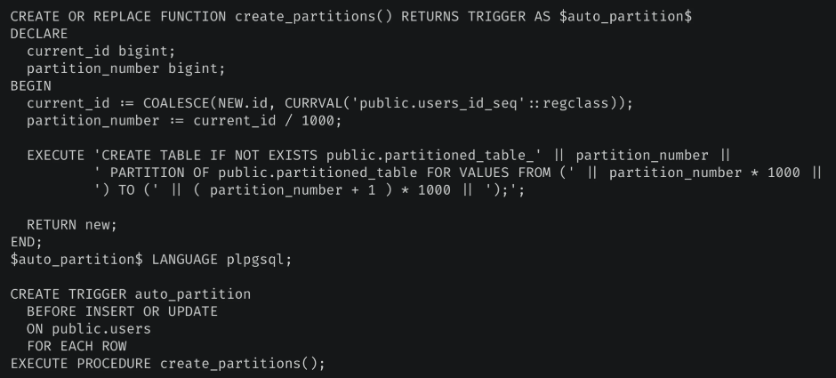
> 

---

### Задача 4
Используя утилиту `pg_dump`, создайте бекап БД `test_database`.

Как бы вы доработали бэкап-файл, чтобы добавить уникальность значения столбца `title` для таблиц `test_database`?


> #### Ответ:
> Создание дампа [test_dump_new.sql](postgresql/backup/test_dump_new.sql): 
> ```sql
> pg_dump -U postgres -O -F p -C test_database > /docker-entrypoint-initdb.d/test_dump_new.sql
> ```
> Чтобы добавить уникальность значения столбца `title`, можно: 
> 1) Создать индекс, он создастся в т.ч. и для партиций:
> ```sql
> CREATE INDEX uniq_title ON orders(title);
> ```
> 2) Изменить команду `CREATE TABLE`:
> ```sql
> CREATE TABLE public.orders (
>     id integer NOT NULL,
>     title character varying(80) NOT NULL CONSTRAINT unique_title UNIQUE,
>     price integer DEFAULT 0
> );
> ```
> 
---