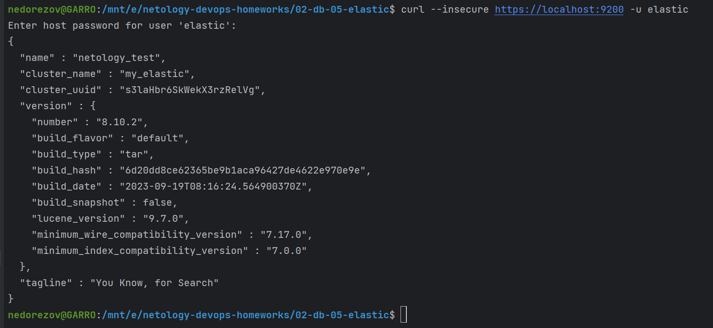
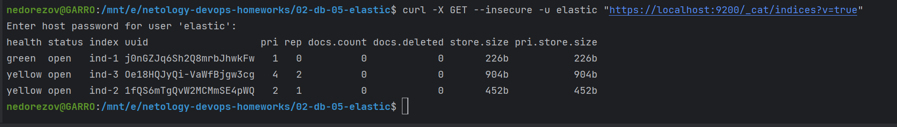
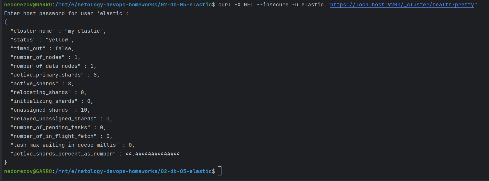
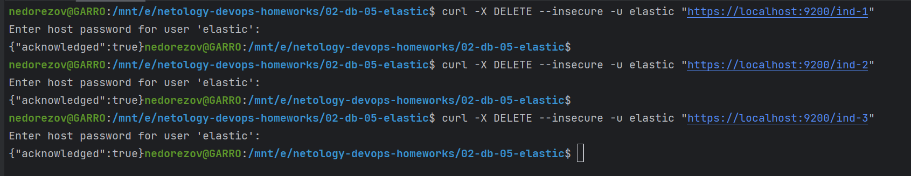
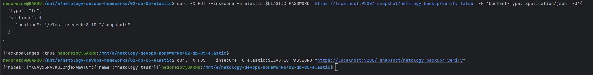
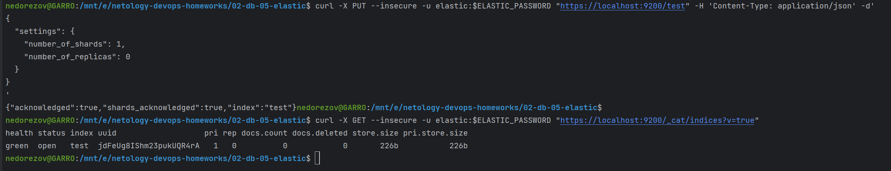
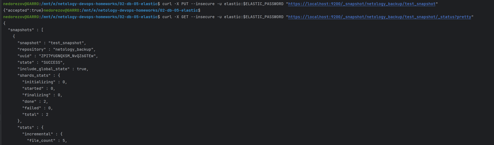
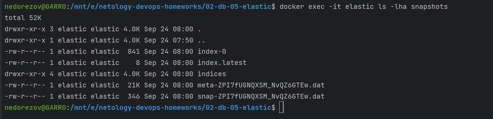
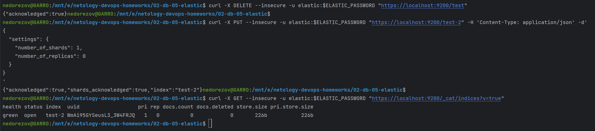
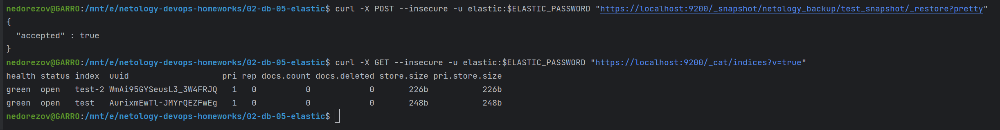

# Домашнее задание к занятию "Elasticsearch" - `Александр Недорезов`

### Задача 1
В этом задании вы потренируетесь в:

- установке Elasticsearch,
- первоначальном конфигурировании Elasticsearch,
- запуске Elasticsearch в Docker.

Используя Docker-образ [centos:7](https://hub.docker.com/_/centos) как базовый и 
[документацию по установке и запуску Elastcisearch](https://www.elastic.co/guide/en/elasticsearch/reference/current/targz.html):

- составьте Dockerfile-манифест для Elasticsearch,
- соберите Docker-образ и сделайте `push` в ваш docker.io-репозиторий,
- запустите контейнер из получившегося образа и выполните запрос пути `/` с хост-машины.

Требования к `elasticsearch.yml`:

- данные `path` должны сохраняться в `/var/lib`,
- имя ноды должно быть `netology_test`.

В ответе приведите:

- текст Dockerfile-манифеста,
- ссылку на образ в репозитории dockerhub,
- ответ `Elasticsearch` на запрос пути `/` в json-виде.

> #### Ответ:
> Составил [Dockerfile](Dockerfile), конфигурация подтягивается из [elasticsearch.yml](config/elasticsearch.yml).
> 
> Образ разместил в [Docker Hub](https://hub.docker.com/r/nedorezov/elastic/tags).
> 
> Результат запроса к https://localhost:9200/  
> 

---

### Задача 2

В этом задании вы научитесь:

- создавать и удалять индексы,
- изучать состояние кластера,
- обосновывать причину деградации доступности данных.

Ознакомьтесь с [документацией](https://www.elastic.co/guide/en/elasticsearch/reference/current/indices-create-index.html) 
и добавьте в `Elasticsearch` 3 индекса в соответствии с таблицей:

| Имя | Количество реплик | Количество шард |
|-----|-------------------|-----------------|
| ind-1| 0 | 1 |
| ind-2 | 1 | 2 |
| ind-3 | 2 | 4 |

Получите список индексов и их статусов, используя API, и **приведите в ответе** на задание.

Получите состояние кластера `Elasticsearch`, используя API.

Как вы думаете, почему часть индексов и кластер находятся в состоянии yellow?

Удалите все индексы.

**Важно**

При проектировании кластера Elasticsearch нужно корректно рассчитывать количество реплик и шард,
иначе возможна потеря данных индексов, вплоть до полной, при деградации системы.

> #### Ответ:
> Для создания индексов также воспользуемся curl и API:
> ```shell
> curl -X PUT --insecure -u elastic "https://localhost:9200/ind-1" -H 'Content-Type: application/json' -d'       
> {
>   "settings": {
>     "number_of_shards": 1,
>     "number_of_replicas": 0
>   }
> }
> '
> curl -X PUT --insecure -u elastic "https://localhost:9200/ind-2" -H 'Content-Type: application/json' -d'       
> {
>   "settings": {
>     "number_of_shards": 2,
>     "number_of_replicas": 1
>   }
> }
> '
> curl -X PUT --insecure -u elastic "https://localhost:9200/ind-3" -H 'Content-Type: application/json' -d'       
> {
>   "settings": {
>     "number_of_shards": 4,
>     "number_of_replicas": 2
>   }
> }
> '
> ```
> 
> Статус индексов:  
> 
> 
> Статус кластера:  
> 
> 
> Индексы и кластер в статусе *yellow* потому, что в кластере всего одна нода, поэтому репликация невозможна, а у yellow-индексов 1 или больше реплик в параметрах. 
> 
> Удаляем индексы через API: 
> 
> 
> 
---

### Задача 3

В этом задании вы научитесь:

- создавать бэкапы данных,
- восстанавливать индексы из бэкапов.

Создайте директорию `{путь до корневой директории с Elasticsearch в образе}/snapshots`.

Используя API, [зарегистрируйте](https://www.elastic.co/guide/en/elasticsearch/reference/current/snapshots-register-repository.html#snapshots-register-repository) 
эту директорию как `snapshot repository` c именем `netology_backup`.

**Приведите в ответе** запрос API и результат вызова API для создания репозитория.

Создайте индекс `test` с 0 реплик и 1 шардом и **приведите в ответе** список индексов.

[Создайте `snapshot`](https://www.elastic.co/guide/en/elasticsearch/reference/current/snapshots-take-snapshot.html) 
состояния кластера `Elasticsearch`.

**Приведите в ответе** список файлов в директории со `snapshot`.

Удалите индекс `test` и создайте индекс `test-2`. **Приведите в ответе** список индексов.

[Восстановите](https://www.elastic.co/guide/en/elasticsearch/reference/current/snapshots-restore-snapshot.html) состояние
кластера `Elasticsearch` из `snapshot`, созданного ранее. 

**Приведите в ответе** запрос к API восстановления и итоговый список индексов.


> #### Ответ:
> Добавил настройку `repo: snapshots` в config, пересобрал и запустил Elasticsearch.
> 
> Регистрация snapshot repo: 
> 
> 
> Создал индекс `test`, его статус:
> 
> 
> Создал снапшот `test_snapshot`, статус выполнения: 
> 
> 
> Содержимое каталога snapshots:
> 
> 
> Удаляем индекс `test`, создаем `test-2`:
> 
> 
> Восстанавливаем состояние из snapshot, и итоговый список индексов:
> 
>

---
