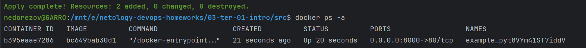
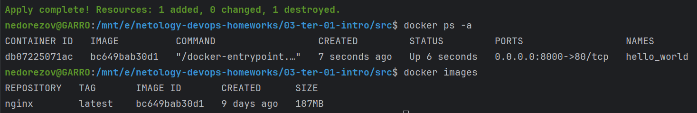
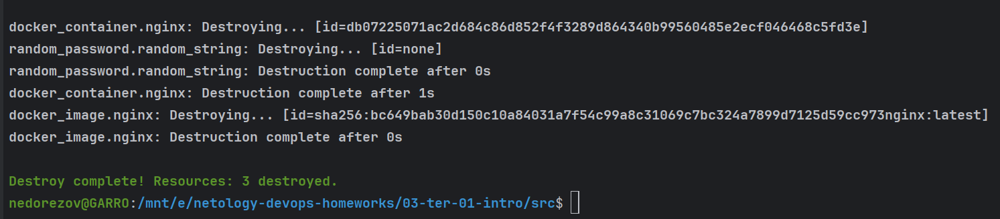
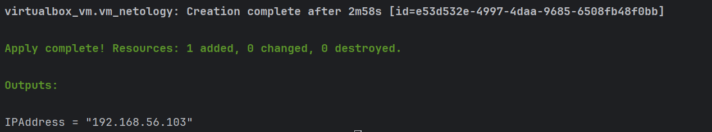
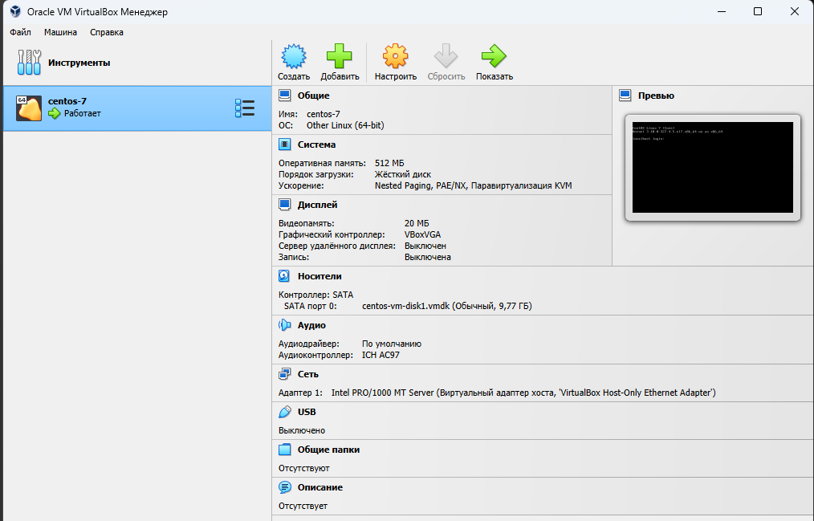

# Домашнее задание к занятию «Введение в Terraform»

------

### Задание 1

1. Перейдите в каталог [**src**](https://github.com/netology-code/ter-homeworks/tree/main/01/src). Скачайте все необходимые зависимости, использованные в проекте. 
2. Изучите файл **.gitignore**. В каком terraform-файле, согласно этому .gitignore, допустимо сохранить личную, секретную информацию?

    > В файле _**personal.auto.tfvars**_  
3. Выполните код проекта. Найдите в state-файле секретное содержимое созданного ресурса **random_password**, пришлите в качестве ответа конкретный ключ и его значение.
    > В файле _**terraform.tfstate**_ созданный ресурс:  
    > "type": "random_password",  
      "name": "random_string",  
      "result": "pyt8VYm41ST7iddV",
4. Раскомментируйте блок кода, примерно расположенный на строчках 29–42 файла **main.tf**.
Выполните команду ```terraform validate```. Объясните, в чём заключаются намеренно допущенные ошибки. Исправьте их.
    
    > * "docker_image" - ресурсу не назначено имя, хотя в "docker_container" мы обращаемся по имени "docker_image.nginx.image_id";  
    > * "docker_container" - имя начинается с цифры (1nginx), тогда как может только с буквы или символа подчеркивания; 
    > 
    > Есть и другая ошибка, на которую `terraform validate` укажет только после устранения предыдущих:
    > * Имя контейнера формируется как `example_${random_password.random_string_FAKE.resulT}`, а правильно:
    > `example_${random_password.random_string.result}`

5. Выполните код. В качестве ответа приложите: исправленный фрагмент кода и вывод команды ```docker ps```.
    > Исправленный код:  
    >  ```terraform
    >  resource "docker_image" "nginx"{
    >    name         = "nginx:latest"
    >    keep_locally = true
    >  }
    >  
    >  resource "docker_container" "nginx" {
    >    image = docker_image.nginx.image_id
    >    name  = "example_${random_password.random_string.result}"
    >  
    >    ports {
    >      internal = 80
    >      external = 8000
    >    }
    >  }
    >  ```
    > Вывод команды:  

       
6. Замените имя docker-контейнера в блоке кода на ```hello_world```. Не перепутайте имя контейнера и имя образа. Мы всё ещё продолжаем использовать name = "nginx:latest". Выполните команду ```terraform apply -auto-approve```.
Объясните своими словами, в чём может быть опасность применения ключа  ```-auto-approve```. В качестве ответа дополнительно приложите вывод команды ```docker ps```.

      
    > Ключ `-auto-approve` отключает интерактивное подтверждение `apply`, т.е. мы не можем до применения изменений проверить
    > план этих изменений (что уничтожается, изменяется, добавляется), и в случае ошибки его подкорректировать.
7. Уничтожьте созданные ресурсы с помощью **terraform**. Убедитесь, что все ресурсы удалены. Приложите содержимое файла **terraform.tfstate**.
    
    > Результат `terraform destroy`:

     

    > Содержимое _terraform.tfstate_:
    > ```json
    > {
    >   "version": 4,
    >   "terraform_version": "1.5.5",
    >   "serial": 14,
    >   "lineage": "ffe9d3ac-5b75-3509-185b-83c0c4ba7188",
    >   "outputs": {},
    >   "resources": [],
    >   "check_results": null
    > }
    > ```
    > 
8. Объясните, почему при этом не был удалён docker-образ **nginx:latest**. Ответ **обязательно** подкрепите строчкой из документации [**terraform провайдера docker**](https://docs.comcloud.xyz/providers/kreuzwerker/docker/latest/docs).  (ищите в классификаторе resource docker_image )
    > Всё из-за указанного параметра `keep_locally = true`. Т.е. при удалении ресурса сам image останется в локальном хранилище docker
    > 
    > Из документации:  
    > `keep_locally` - (Boolean) If true, then the Docker image won't be deleted on destroy operation. If this is false, it will delete the image from the docker local storage on destroy operation.

------


### Задание 2*

1. Изучите в документации provider [**Virtualbox**](https://docs.comcloud.xyz/providers/shekeriev/virtualbox/latest/docs) от 
shekeriev.
2. Создайте с его помощью любую виртуальную машину. Чтобы не использовать VPN, советуем выбрать любой образ с расположением в GitHub из [**списка**](https://www.vagrantbox.es/).

В качестве ответа приложите plan для создаваемого ресурса и скриншот созданного в VB ресурса. 
> #### Ответ:
> Terraform-конфигурация: [/03-ter-01-intro/vm/main.tf](vm/main.tf)  
> Plan создаваемого ресурса:
> ```shell
> PS E:\netology-devops-homeworks\03-ter-01-intro\vm> terraform apply  
> 
> Terraform used the selected providers to generate the following execution plan. Resource actions are indicated with the following symbols:
>   + create
> 
> Terraform will perform the following actions:
> 
>   # virtualbox_vm.vm_netology will be created
>   + resource "virtualbox_vm" "vm_netology" {
>       + cpus   = 1
>       + id     = (known after apply)
>       + image  = "https://github.com/CommanderK5/packer-centos-template/releases/download/0.7.2/vagrant-centos-7.2.box"
>       + memory = "512 mib"
>       + name   = "centos-7"
>       + status = "running"
> 
>       + network_adapter {
>           + device                 = "IntelPro1000MTServer"
>           + host_interface         = "VirtualBox Host-Only Ethernet Adapter"
>           + ipv4_address           = (known after apply)
>           + ipv4_address_available = (known after apply)
>           + mac_address            = (known after apply)
>           + status                 = (known after apply)
>           + type                   = "hostonly"
>         }
>     }
> 
> Plan: 1 to add, 0 to change, 0 to destroy.
> 
> Changes to Outputs:
>   + IPAddress = (known after apply)
> ```
> 
> Результат выполнения:  
> 
> 
>   
------
