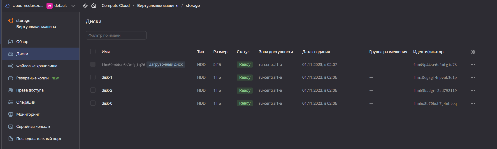

# Домашнее задание к занятию «Основы Terraform. Yandex Cloud»  
## Студент: Александр Недорезов 

------

### Цели задания

1. Отработать основные принципы и методы работы с управляющими конструкциями Terraform.
2. Освоить работу с шаблонизатором Terraform (Interpolation Syntax).

### Инструменты и дополнительные материалы, которые пригодятся для выполнения задания

1. [Консоль управления Yandex Cloud](https://console.cloud.yandex.ru/folders/<cloud_id>/vpc/security-groups).
2. [Группы безопасности](https://cloud.yandex.ru/docs/vpc/concepts/security-groups?from=int-console-help-center-or-nav).
3. [Datasource compute disk](https://terraform-eap.website.yandexcloud.net/docs/providers/yandex/d/datasource_compute_disk.html).

------

## Задание 1
1. Изучите проект.
2. Заполните файл personal.auto.tfvars.
3. Инициализируйте проект, выполните код. Он выполнится, даже если доступа к preview нет.

Примечание. Если у вас не активирован preview-доступ к функционалу «Группы безопасности» в Yandex Cloud, запросите доступ у поддержки облачного провайдера. Обычно его выдают в течение 24-х часов.

Приложите скриншот входящих правил «Группы безопасности» в ЛК Yandex Cloud или скриншот отказа в предоставлении доступа к preview-версии.


> ### Ответ:
> Изучил проект, заполнил `personal.auto.tfvars`, выполнил `terraform plan` + `apply`. В результате в YC создана группа сеть `develop` с подсетью `develop` и группой безопасности `example_dynamic`:
> 
> 


------

## Задача 2
1. Создайте файл count-vm.tf. Опишите в нём создание двух **одинаковых** ВМ web-1 и web-2 (не web-0 и web-1) с минимальными параметрами, 
используя мета-аргумент **count loop**. Назначьте ВМ созданную в первом задании группу безопасности.
(как это сделать узнайте в документации провайдера yandex/compute_instance )
2. Создайте файл for_each-vm.tf. Опишите в нём создание двух ВМ с именами "main" и "replica" **разных** по cpu/ram/disk , 
используя мета-аргумент **for_each loop**. Используйте для обеих ВМ одну общую переменную типа 
list(object({ vm_name=string, cpu=number, ram=number, disk=number  })). При желании внесите в переменную все возможные параметры.
3. ВМ из пункта 2.2 должны создаваться после создания ВМ из пункта 2.1.
4. Используйте функцию file в local-переменной для считывания ключа ~/.ssh/id_rsa.pub и его последующего использования в блоке metadata, взятому из ДЗ 2.
5. Инициализируйте проект, выполните код.

> ### Ответ:
> В файле [variables.tf](src/variables.tf) добавил переменные `web_vm` и `backend_vm` с дефолтными параметрами для создания ВМ. Все параметры вынесены в переменные, без хардкода.
> 
> В файле [count-vm.tf](src/count-vm.tf) описал создание двух одинаковых ВМ web-1 и web-2, в файле [for_each-vm.tf](src/for_each-vm.tf) описал создание main и replica (допустил, что это backend).
> 
> С помощью `depends_on` обозначил, что `backend`-ВМ создается только после `web`-ВМ. 
> 
> В файле [locals.tf](src/locals.tf) происходит считывание открытой части ключа из файла и составление local-метаданных, которые затем с помощью `merge` соединяем с metadata из variables ВМ.
> 
> Выполнил `terraform plan` + `terraform apply`, дополнительные ресурсы успешно созданы:
> 
> 

------

## Задача 3
1. Создайте 3 одинаковых виртуальных диска размером 1 Гб с помощью ресурса yandex_compute_disk и мета-аргумента count в файле **disk_vm.tf**.
2. Создайте в том же файле **одиночную**(использовать count или for_each запрещено из-за задания №4) ВМ c именем "storage" . Используйте блок **dynamic secondary_disk{..}** и мета-аргумент for_each для подключения созданных вами дополнительных дисков.

> ### Ответ:
> В файле [disk_vm.tf](src/disk_vm.tf) создал ресурс с дисками и ВМ `storage`, используя параметры из переменной `storage_vm` в [variables.rf](src/variables.tf).
> 
> Выполнил `terraform plan` + `terraform apply`, дополнительные ресурсы успешно созданы:
> 
> 


------

## Задача 4
1. В файле ansible.tf создайте inventory-файл для ansible.
Используйте функцию tepmplatefile и файл-шаблон для создания ansible inventory-файла из лекции.
Готовый код возьмите из демонстрации к лекции [**demonstration2**](https://github.com/netology-code/ter-homeworks/tree/main/03/demonstration2).
Передайте в него в качестве переменных группы виртуальных машин из задания 2.1, 2.2 и 3.2, т. е. 5 ВМ.
2. Инвентарь должен содержать 3 группы [webservers], [databases], [storage] и быть динамическим, т. е. обработать как группу из 2-х ВМ, так и 999 ВМ.
3. Выполните код. Приложите скриншот получившегося файла. 


> ### Ответ:
> Создал ресурс `local_file` в [ansible.tf](src/ansible.tf) для генерации inventory с помощью tepmplatefile, также сформировал template [inventory.tftpl](src/inventory.tftpl).
> В шаблоне три динамические группы, которые заполняются через цикл for.  
> 
> Сгенерированный файл:
> 

------

## Задача 5*
1. Напишите output, который отобразит все 5 созданных ВМ в виде списка словарей:
``` 
[
 {
  "name" = 'имя ВМ1'
  "id"   = 'идентификатор ВМ1'
  "fqdn" = 'Внутренний FQDN ВМ1'
 },
 {
  "name" = 'имя ВМ2'
  "id"   = 'идентификатор ВМ2'
  "fqdn" = 'Внутренний FQDN ВМ2'
 },
 ....
]
```
Приложите скриншот вывода команды ```terrafrom output```.

> ### Ответ:
> Код размещен в [output.tf](src/output.tf). 
> 

------

## Задача 6*
1. Используя null_resource и local-exec, примените ansible-playbook к ВМ из ansible inventory-файла.
Готовый код возьмите из демонстрации к лекции [**demonstration2**](https://github.com/netology-code/ter-homeworks/tree/main/demonstration2).
2. Дополните файл шаблон hosts.tftpl. 
Формат готового файла:
```netology-develop-platform-web-0   ansible_host="<внешний IP-address или внутренний IP-address если у ВМ отсутвует внешний адрес>"```

Для проверки работы уберите у ВМ внешние адреса. Этот вариант используется при работе через bastion-сервер.
Для зачёта предоставьте код вместе с основной частью задания.


> ### Ответ:
> п.1 - Дополнил [ansible.tf](src/ansible.tf) ресурсом `null_resource` "provision_web".  
> 
> Будет запускаться только после `yandex_compute_instance.web` и `local_file.inventory`.  
> Костыль "sleep" убрал, вместо этого дополнил плейбук [playbook.yml](src/playbook.yml) заданием на wait_for 22 порт. 
> Также плейбук только для хостов `webservers`, плюс еще немного рефакторинга.
> 
> Результат provision в общем пайплайне `terraform apply`:
> 
> 
> п.2 - Доработал шаблон инвентори [inventory.tftpl](src/inventory.tftpl), чтобы проверять пустое значение `nat_ip_address` (хотелось через try-функцию, но тут не null)
> ```shell
> ${i.network_interface[0].nat_ip_address == "" ? i.network_interface[0].ip_address : i.network_interface[0].nat_ip_address}
> ```
> Для тестирования указал для ВМ `storage` значение переменной `storage_vm.nat = false`
> 
> Результат: 
> 

------