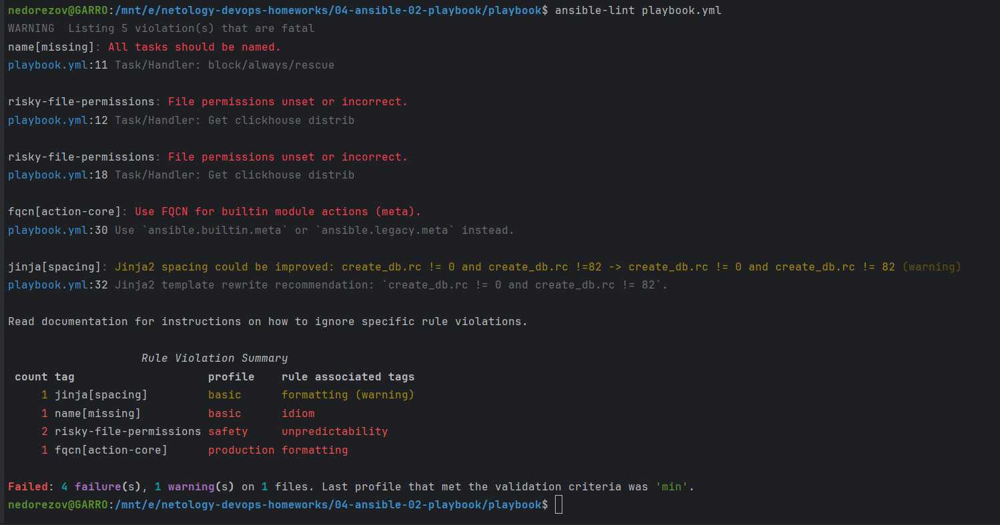
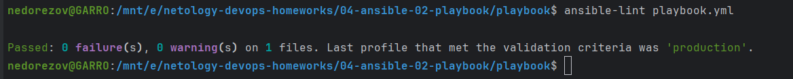
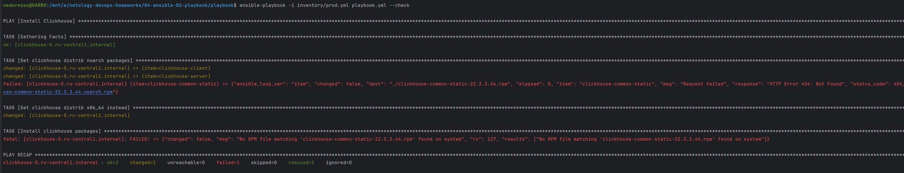
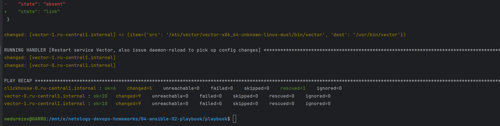
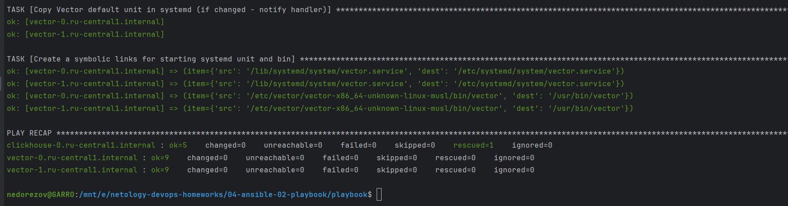

# Домашнее задание к занятию "Работа с Playbook"
## Студент: Александр Недорезов 

## Подготовка к выполнению

1. * Необязательно. Изучите, что такое [ClickHouse](https://www.youtube.com/watch?v=fjTNS2zkeBs) и [Vector](https://www.youtube.com/watch?v=CgEhyffisLY).
2. Создайте свой публичный репозиторий на GitHub с произвольным именем или используйте старый.
3. Скачайте [Playbook](./playbook/) из репозитория с домашним заданием и перенесите его в свой репозиторий.
4. Подготовьте хосты в соответствии с группами из предподготовленного playbook.

------

## Задание 1 (основная часть)

1. Подготовьте свой inventory-файл `prod.yml`.
> #### Ответ:
> Для подготовки окружения использовал [terraform](./terraform) с модулями, в результате динамически
> формируется inventory [prod.yml](playbook/inventory/prod.example.yml) по шаблону [inventory.tftpl](terraform/inventory.tftpl).  
> Clickhouse будет ставиться на отдельную ВМ, Vector на две другие ВМ. Также решил сразу настроить отправку логов из vector в Clickhouse, что прописал в security rules.

2. Допишите playbook: нужно сделать ещё один play, который устанавливает и настраивает [vector](https://vector.dev). 
Конфигурация vector должна деплоиться через template файл jinja2. От вас не требуется использовать все возможности шаблонизатора, 
просто вставьте стандартный конфиг в template файл. 
Информация по шаблонам по [ссылке](https://www.dmosk.ru/instruktions.php?object=ansible-nginx-install).
3. При создании tasks рекомендую использовать модули: `get_url`, `template`, `unarchive`, `file`.
4. Tasks должны: скачать дистрибутив нужной версии, выполнить распаковку в выбранную директорию, установить vector.
> #### Ответ:
> Добавил play "Install Vector" в [плейбук](playbook/playbook.yml). Сразу предусмотрел идемпотентность и старался следовать основным правилам линтера.

5. Запустите `ansible-lint site.yml` и исправьте ошибки, если они есть.
> #### Ответ:
> Первый прогон линтера показал следующие ошибки: 
> 
> - playbook.yml:11 Task/Handler: block/always/rescue - добавил `name` для блока, таски назвал более понятными именами
> - playbook.yml:12 Task/Handler: Get clickhouse distrib - добавил `mode`
> - playbook.yml:18 Task/Handler: Get clickhouse distrib - добавил `mode`
> - playbook.yml:30 - `meta` заменил на `ansible.builtin.
> - playbook.yml:32 - добавил пробел, rewrite recommendation: `create_db.rc != 0 and create_db.rc != 82`.
> 
> Также добавил таск на редактирование конфига, чтобы установить параметр `listen_host`.
> 
> Повторный прогон линтера без ошибок:
> 

6. Попробуйте запустить playbook на этом окружении с флагом `--check`.
> #### Ответ:
> Запуск `check` ожидаемо сломался на стадии "Install clickhouse packages", т.к. таски здесь изменений не выполняют, а значит и .rpm-пакетов для инсталляции на таргет-хосте не существует.
> 

7. Запустите playbook на `prod.yml` окружении с флагом `--diff`. Убедитесь, что изменения на системе произведены.
> #### Ответ: 
> Запустил плейбук, выполнился успешно:
> 
> Сервисы запущены, Vector законнектился к Clickhouse

8. Повторно запустите playbook с флагом `--diff` и убедитесь, что playbook идемпотентен.
> #### Ответ: 
> Recap повторного запуска показал, что изменений не было, а значит, идемпотентность соблюдена:
> 

9. Подготовьте README.md-файл по своему playbook. В нём должно быть описано: что делает playbook, какие у него есть параметры и теги. 
Пример качественной документации ansible playbook по [ссылке](https://github.com/opensearch-project/ansible-playbook).
> #### Ответ: 
> Ссылка на [README.md](playbook/README.md)

10. Готовый playbook выложите в свой репозиторий, поставьте тег `08-ansible-02-playbook` на фиксирующий коммит, в ответ предоставьте ссылку на него.