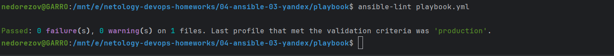
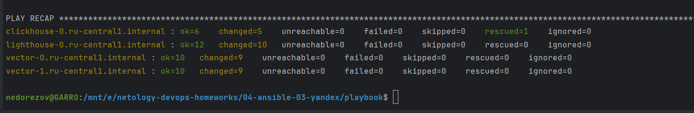
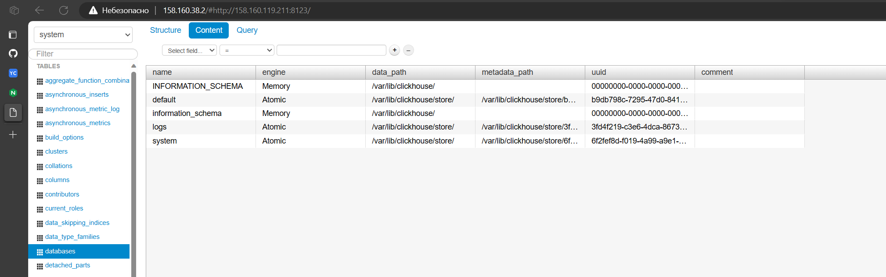
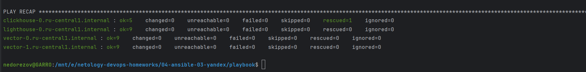

# Домашнее задание к занятию "Использование Ansible"
## Студент: Александр Недорезов 

## Подготовка к выполнению

1. Подготовьте в Yandex Cloud три хоста: для `clickhouse`, для `vector` и для `lighthouse`.
2. Репозиторий LightHouse находится [по ссылке](https://github.com/VKCOM/lighthouse).

------

## Задание 1 (основная часть)

1. Допишите playbook: нужно сделать ещё один play, который устанавливает и настраивает LightHouse.
2. При создании tasks рекомендую использовать модули: `get_url`, `template`, `yum`, `apt`.
3. Tasks должны: скачать статику LightHouse, установить Nginx или любой другой веб-сервер, настроить его конфиг для открытия LightHouse, запустить веб-сервер.
> #### Ответ:
> Дополнил плейбук из предыдущего задания двумя плеями `Install NGINX` и `Install Lighthouse`: [playbook.yml](playbook/playbook.yml)
> (учел ошибку, где пропустил запуск handler на изменение конфигурации)

4. Подготовьте свой inventory-файл `prod.yml`.
> #### Ответ:
> Как и в прошлом задании, для подготовки окружения использовал [terraform](./terraform) с модулями, в результате динамически
> формируется inventory [prod.yml](playbook/inventory/prod.example.yml) по шаблону [inventory.tftpl](terraform/inventory.tftpl).  
> Clickhouse и Lighthouse будут ставиться на отдельные ВМ, Vector на две другие ВМ.

5. Запустите `ansible-lint site.yml` и исправьте ошибки, если они есть.
> #### Ответ:
> Исправил ошибки, которые показал линтер. Повторный запуск: 
> 

6. Попробуйте запустить playbook на этом окружении с флагом `--check`.
7. Запустите playbook на `prod.yml` окружении с флагом `--diff`. Убедитесь, что изменения на системе произведены.
> #### Ответ:
> Запустил плейбук, выполнился успешно: 
> 
>
> Проверим доступность Lighthouse и успешный коннект к БД Clickhouse:
> 

8. Повторно запустите playbook с флагом `--diff` и убедитесь, что playbook идемпотентен.
> #### Ответ:
> Повторный запуск не внёс изменений, т.е. идемпотентность соблюдена:
> 

9. Подготовьте README.md-файл по своему playbook. В нём должно быть описано: что делает playbook, какие у него есть параметры и теги.
> #### Ответ:
> Актуализировал README из предыдущего задания:
> [README.md](playbook/README.md)

10. Готовый playbook выложите в свой репозиторий, поставьте тег `08-ansible-03-yandex` на фиксирующий коммит, в ответ предоставьте ссылку на него.