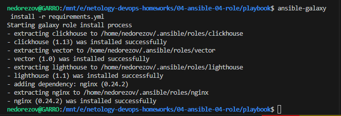
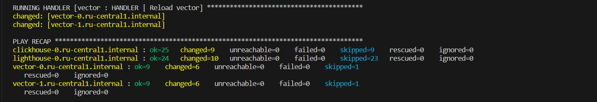
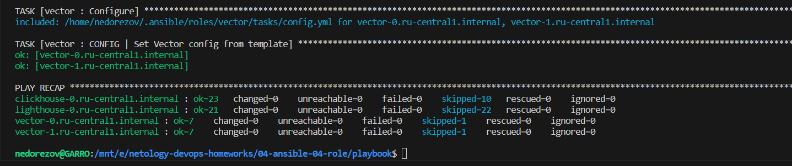
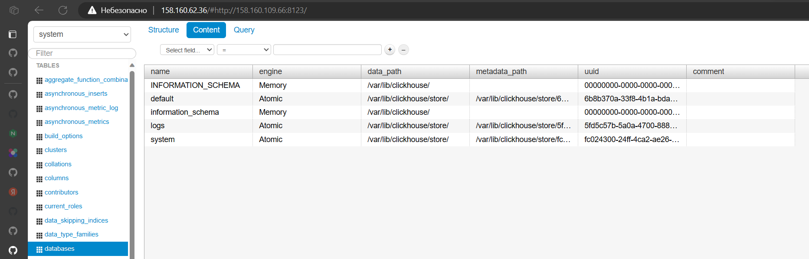

# Домашнее задание к занятию "Работа с roles"

## Студент: Александр Недорезов

## Подготовка к выполнению

1. * Необязательно. Познакомьтесь с [LightHouse](https://youtu.be/ymlrNlaHzIY?t=929).
2. Создайте два пустых публичных репозитория в любом своём проекте: vector-role и lighthouse-role.
3. Добавьте публичную часть своего ключа к своему профилю на GitHub.

------

## Задание 1 (основная часть)

Ваша цель — разбить ваш playbook на отдельные roles.

Задача — сделать roles для ClickHouse, Vector и LightHouse и написать playbook для использования этих ролей.

Ожидаемый результат — существуют три ваших репозитория: два с roles и один с playbook.

1. Создайте в старой версии playbook файл `requirements.yml` и заполните его содержимым:

   ```yaml
   ---
     - src: git@github.com:AlexeySetevoi/ansible-clickhouse.git
       scm: git
       version: "1.13"
       name: clickhouse 
   ```

2. При помощи `ansible-galaxy` скачайте себе эту роль.
3. Создайте новый каталог с ролью при помощи `ansible-galaxy role init vector-role`.
4. На основе tasks из старого playbook заполните новую role. Разнесите переменные между `vars` и `default`.
5. Перенести нужные шаблоны конфигов в `templates`.
6. Опишите в `README.md` обе роли и их параметры. Пример качественной документации ansible role [по ссылке](https://github.com/cloudalchemy/ansible-prometheus).
7. Повторите шаги 3–6 для LightHouse. Помните, что одна роль должна настраивать один продукт.
8. Выложите все roles в репозитории. Проставьте теги, используя семантическую нумерацию. Добавьте roles в `requirements.yml` в playbook.
9. Переработайте playbook на использование roles. Не забудьте про зависимости LightHouse и возможности совмещения `roles` с `tasks`.
10. Выложите playbook в репозиторий.
11. В ответе дайте ссылки на оба репозитория с roles и одну ссылку на репозиторий с playbook.

> ### Ответ
>
> 1. Инфраструктура по-прежнему создается с помощью [terraform](./terraform) с модулями, в результате динамически формируется inventory [prod.yml](playbook/inventory/prod.example.yml) по шаблону [inventory.tftpl](terraform/inventory.tftpl).  
> Clickhouse и Lighthouse будут ставиться на отдельные ВМ, Vector на две другие ВМ.
>
> 2. Инициализировал роли ansible_role_vector и ansible_role_lighthouse (поменял имена, т.к. по новым правилам ansible-lint имя роли должно соответствовать `^[a-z][a-z0-9_]*$`)
>
> 3. Оформил структуру, описал meta и README.md для ролей. Перенес таски и переменные для них из старого плейбука в роли, дополнил проверками на семейство дистрибутива. Линтером проверил код, исправил ошибки форматирования, затем выложил роли в GIT и создал теги по результирующим коммитам.  
> Ссылки на репозитории:
>
>    * [Роль `ansible_role_lighthouse`](https://github.com/smutosey/ansible_role_lighthouse). В качестве зависимости роль использует официальную роль `nginxinc.nginx`
>    * [Роль `ansible_role_vector`](https://github.com/smutosey/ansible_role_vector)
>
> 4. Создал файл [requirements.yml](playbook/requirements.yml), где описал инсталляцию ролей, привязку версии.  
> Установка прошла успешно:  
> 
>
> 5. Сформировал [playbook.yml](playbook/playbook.yml), для play "Install Lighthouse" добавил pre_tasks с установкой git. Запустил плейбук, изменения применены успешно:  
> 
> Повторный запуск плейбука показал отсутствие изменений, т.е. идемпотентность соблюдена:  
> 
>
> 6. Доступ к Lighthouse и коннект к Clickhouse:  
> 
>
> 7. Актуализировал информацию в [README.md](playbook/README.md) плейбука.
