# Домашнее задание к занятию "Использование Ansible"
## Студент: Александр Недорезов 

## Подготовка к выполнению

1. Установите molecule: `pip3 install "molecule==3.5.2"` и драйвера `pip3 install molecule_docker molecule_podman`.
2. Выполните `docker pull aragast/netology:latest` — это образ с podman, tox и несколькими пайтонами (3.7 и 3.9) внутри.

------

## Основная часть

Ваша цель — настроить тестирование ваших ролей.

Задача — сделать сценарии тестирования для vector.

Ожидаемый результат — все сценарии успешно проходят тестирование ролей.

### Molecule

1. Запустите  `molecule test -s centos_7` внутри корневой директории clickhouse-role, посмотрите на вывод команды. Данная команда может отработать с ошибками, это нормально. Наша цель - посмотреть как другие в реальном мире используют молекулу.
2. Перейдите в каталог с ролью vector-role и создайте сценарий тестирования по умолчанию при помощи `molecule init scenario --driver-name docker`.
3. Добавьте несколько разных дистрибутивов (centos:8, ubuntu:latest) для инстансов и протестируйте роль, исправьте найденные ошибки, если они есть.
4. Добавьте несколько assert в verify.yml-файл для проверки работоспособности vector-role (проверка, что конфиг валидный, проверка успешности запуска и др.).
5. Запустите тестирование роли повторно и проверьте, что оно прошло успешно.
6. Добавьте новый тег на коммит с рабочим сценарием в соответствии с семантическим версионированием.

> ### Ответ
> Ссылка на роль: [ansible_role_vector](https://github.com/smutosey/ansible_role_vector)
> В роли создал сценарий molecule (прим.: решил использовать свежую версию molecule, т.к. структурно модуль сильно изменился, хотелось обкатывать уже сразу приближенно к боевым условиям)
> 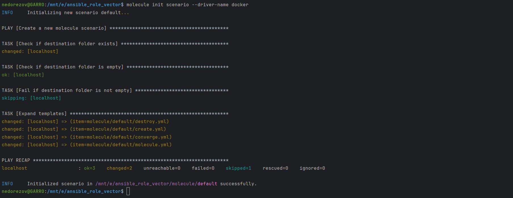  
> Пространство организовал так, что переиспользуемые конфигурации хранятся в molecule/shared, а доп.ресурсы хранятся в molecule/resources.  
> [Дефолтный сценарий](https://github.com/smutosey/ansible_role_vector/blob/main/molecule/default/molecule.yml) устанавливает роль на ubuntu:22.04, centos:7 и centos:8. Инстансы готовятся с > помощью [Dockerfile.j2](https://github.com/smutosey/ansible_role_vector/blob/main/molecule/resources/Dockerfile.j2) на основе базовых образов. Это необходимо для корректной работы systemd и > остальных нюансов запуска сервисов в контейнере, например, устранение проблемы с репозиториями centos-8.  
> В [verify.yml](https://github.com/smutosey/ansible_role_vector/blob/main/molecule/shared/verify.yml) прописал проверку статуса сервиса и обращение к API /health.
> Тестирование роли прошло успешно.
> - Линтинг:
> 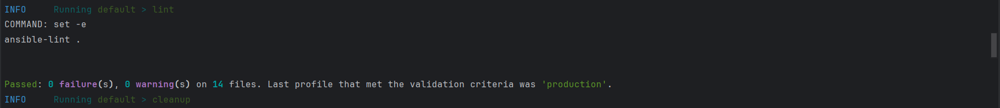
> - Создание контейнеров:
> 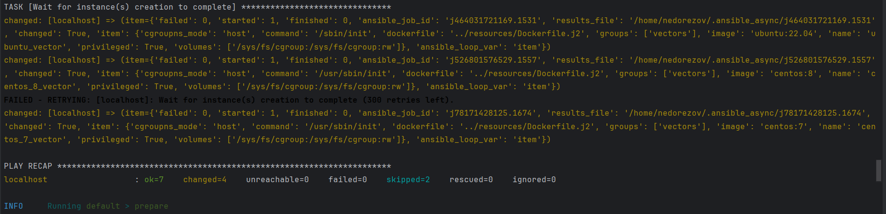  
> - Настройка:
> 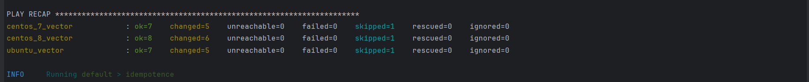
> - Идемпотентность:
> 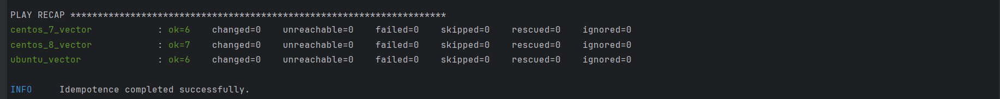 
> - Проверка:
> 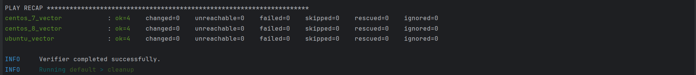
> 
> Изначальный вариант роли дополнялся и редактировался после тестирования с tox и fullstack, поэтому оставляю конечный тег: [[v1.2.0]](https://github.com/smutosey/ansible_role_vector/releases/tag/1.2.0)

### Tox

1. Добавьте в директорию с vector-role файлы из [директории](./example).
2. Запустите `docker run --privileged=True -v <path_to_repo>:/opt/vector-role -w /opt/vector-role -it aragast/netology:latest /bin/bash`, где path_to_repo — путь до корня репозитория с vector-role на вашей файловой системе.
3. Внутри контейнера выполните команду `tox`, посмотрите на вывод.
4. Создайте облегчённый сценарий для `molecule` с драйвером `molecule_podman`. Проверьте его на исполнимость.
5. Пропишите правильную команду в `tox.ini`, чтобы запускался облегчённый сценарий.
6. Запустите команду `tox`. Убедитесь, что всё отработало успешно.
7. Добавьте новый тег на коммит с рабочим сценарием в соответствии с семантическим версионированием.

После выполнения у вас должно получится два сценария molecule и один tox.ini файл в репозитории. Не забудьте указать в ответе теги решений Tox и Molecule заданий. В качестве решения пришлите ссылку на  ваш репозиторий и скриншоты этапов выполнения задания.

> ### Ответ
> Вместо использования образа aragast/netology:latest, т.к. на wsl он совсем не хотел работать, собрал [свой контроллер](../controller/) в Yandex Cloud через terraform с нужными версиями Python и > другими пакетами.
> Tox также использовал свежей версии, поэтому актуализировал [tox.ini](https://github.com/smutosey/ansible_role_vector/blob/main/tox.ini).  
> Основная причина обновления версии была в поиске ошибки, т.к. следуя указаниям окружения в tox собирались неправильно. Выяснил что в [tox-requirements.txt](https://github.com/smutosey/> ansible_role_vector/blob/main/tox-requirements.txt) необходимо было жестко указать версию ansible-compat==1.0.0, а также molecule==3.6.1 и molecule-podman==1.1.0, т.к. иначе установка > python-пакетов вызывала "dependency hell" (например, пакет ansible-lint ставил latest версию ansible-compat, который в свою очередь ставит ansible-corе, а он нам не нужен для этих версий > ansible, там только ansible-base). Вероятно, такая была задумка? :)  
> Для роли Vector создал облегченный сценарий [minimal](https://github.com/smutosey/ansible_role_vector/blob/main/molecule/minimal/molecule.yml) с драйвером podman.
> Тестирование tox прошло успешно:
> 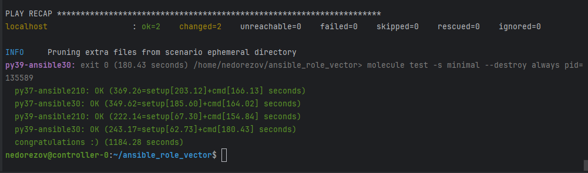
> 
> Изначальный вариант роли дополнялся и редактировался после тестирования с tox и fullstack, поэтому оставляю конечный тег: [[v1.2.0]](https://github.com/smutosey/ansible_role_vector/releases/tag/1.2.0)

## Необязательная часть

1. Проделайте схожие манипуляции для создания роли LightHouse.
2. Создайте сценарий внутри любой из своих ролей, который умеет поднимать весь стек при помощи всех ролей.
3. Убедитесь в работоспособности своего стека. Создайте отдельный verify.yml, который будет проверять работоспособность интеграции всех инструментов между ними.
4. Выложите свои roles в репозитории.

> ### Ответ
> Ссылка на роль: [ansible_role_lighthouse](https://github.com/smutosey/ansible_role_lighthouse)
> Созданы 3 сценария тестирования: 
> - [default](https://github.com/smutosey/ansible_role_lighthouse/blob/main/molecule/default/molecule.yml) - на 2 инстанса: ubuntu22.04 и centos7
> - [minimal](https://github.com/smutosey/ansible_role_lighthouse/blob/main/molecule/minimal/molecule.yml) - только ubuntu для прогона Tox
> - [fullstack](https://github.com/smutosey/ansible_role_lighthouse/blob/main/molecule/fullstack/molecule.yml) - для поднятися всего стека clickhouse+lighthouse+vector. Для него созданы свои > конфигурации converge, requirements и verify
> 
> Прогон default сценария выполнен успешно:
> - Линтинг:
> 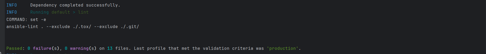
> - Создание контейнеров:
> 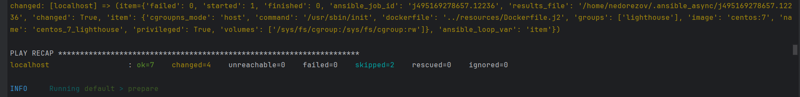  
> - Настройка:
> 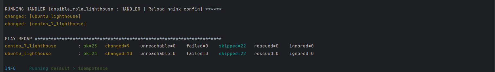
> - Идемпотентность:
> 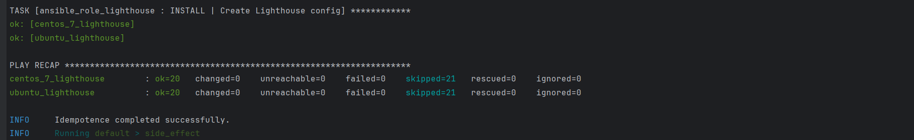 
> - Проверка:
> 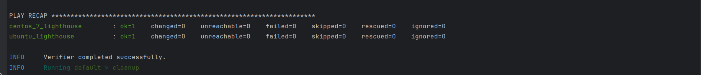
> 
> Тестирование Tox:
> 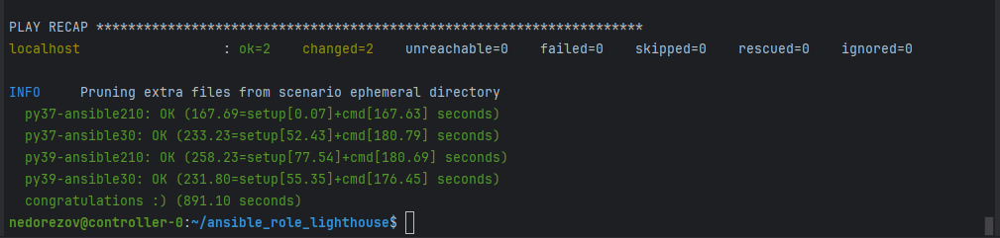 
> 
> Прогон fullstack сценария также выполнен успешно:
> - Линтинг:
> 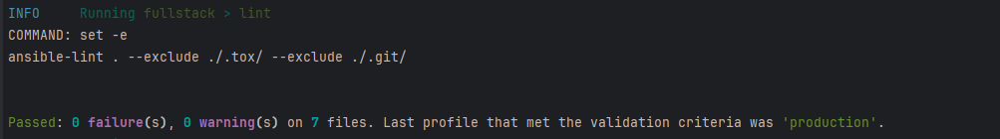
> - Создание контейнеров:
> 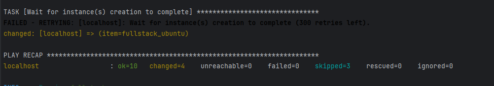  
> - Настройка:
> 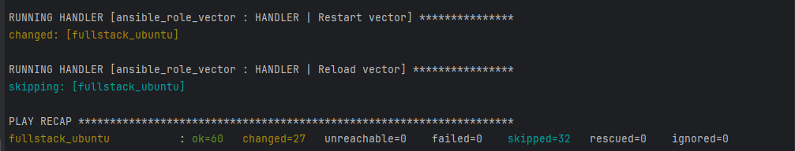
> - Идемпотентность:
> 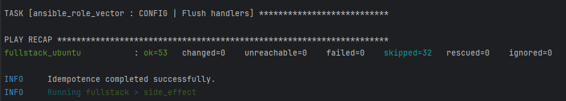 
> - Проверка:
> 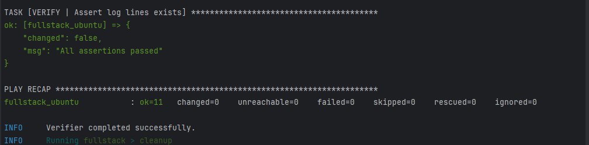
> 
> Полный лог прогона: [fullstack.log](./fullstack.log)
> 
> В части [verify.yml](https://github.com/smutosey/ansible_role_lighthouse/blob/main/molecule/fullstack/verify.yml) проверяются:
> - статусы сервисов
> - наличие БД в clickhouse
> - проверка доступности endpoint Vector (/health) по 8686 и Lighthouse по 80 порту
> - проверка, что логи от Vector появились в таблице БД Clickhouse
> 
> Ссылка на тег: [[1.2.0]](https://github.com/smutosey/ansible_role_lighthouse/releases/tag/1.2.0)

