# Домашнее задание к занятию "Введение в Ansible"
## Студент: Александр Недорезов 

------

## Задание 1

1. Попробуйте запустить playbook на окружении из `test.yml`, зафиксируйте значение, которое имеет факт `some_fact` для указанного хоста при выполнении playbook.
> #### Ответ:
> Запустил плейбук (по умолчанию на hosts: all), значение `some_fact = 12`
> 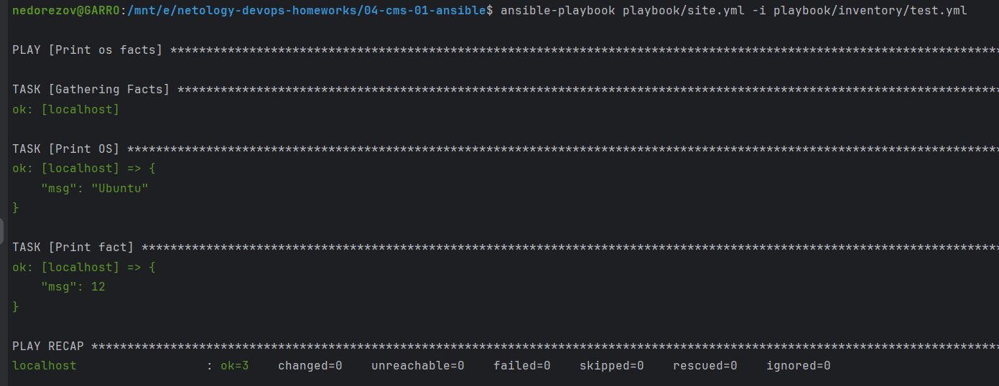

2. Найдите файл с переменными (group_vars), в котором задаётся найденное в первом пункте значение, и поменяйте его на `all default fact`.
> #### Ответ:
> Для группы `all` поменял значение факта в [group_vars/all/examp.yml](playbook/group_vars/all/examp.yml). Запустил playbook:
> 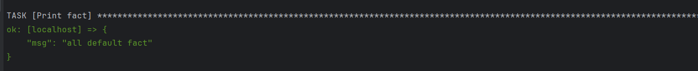

3. Воспользуйтесь подготовленным (используется `docker`) или создайте собственное окружение для проведения дальнейших испытаний.
> #### Ответ:
> Запустил 2 контейнера `ubuntu` и `centos7` на хосте:
> 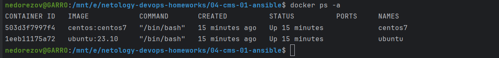

4. Проведите запуск playbook на окружении из `prod.yml`. Зафиксируйте полученные значения `some_fact` для каждого из `managed host`.
> #### Ответ:
> Запустил плейбук на prod-окружении, получил значения `el` для centos и `deb` для ubuntu:
> 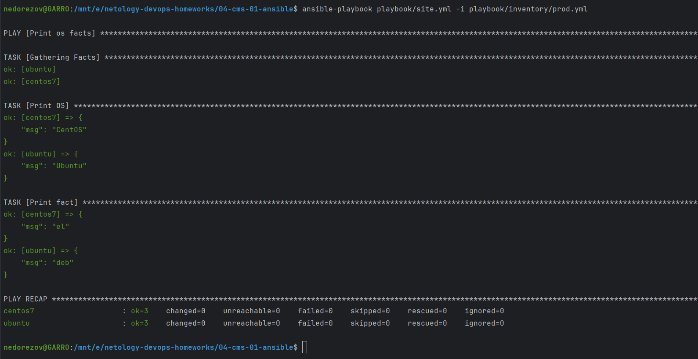

5. Добавьте факты в `group_vars` каждой из групп хостов так, чтобы для `some_fact` получились значения: для `deb` — `deb default fact`, для `el` — `el default fact`.
6. Повторите запуск playbook на окружении `prod.yml`. Убедитесь, что выдаются корректные значения для всех хостов.
> #### Ответ:
> Заменил значения в [group_vars/deb](playbook/group_vars/deb/examp.yml) и [group_vars/el](playbook/group_vars/el/examp.yml). Запуск плейбука: 
> 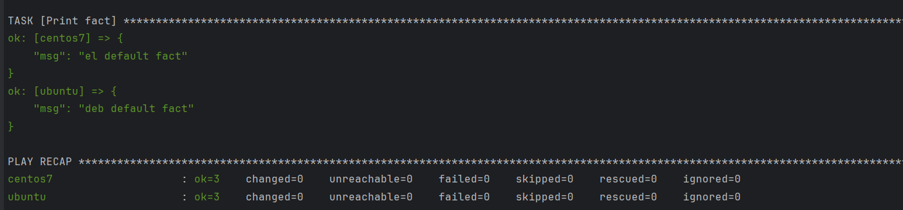

7. При помощи `ansible-vault` зашифруйте факты в `group_vars/deb` и `group_vars/el` с паролем `netology`.
> #### Ответ:
> Шифрование секретов: 
> 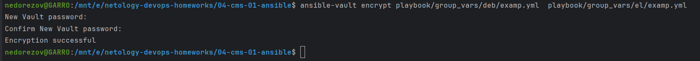
> 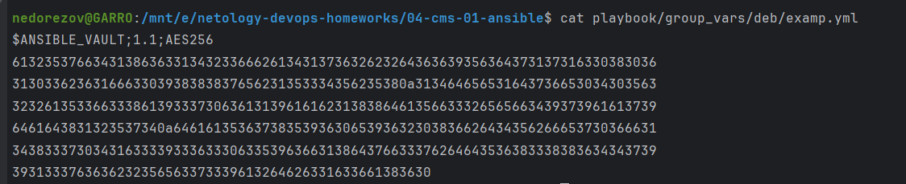

8. Запустите playbook на окружении `prod.yml`. При запуске `ansible` должен запросить у вас пароль. Убедитесь в работоспособности.
> #### Ответ:
> Успешный запуск плейбука с запросом пароля:   
> 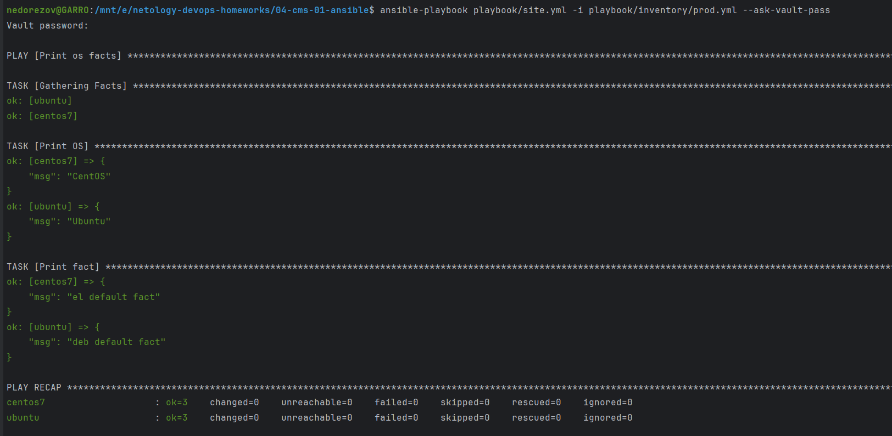

9. Посмотрите при помощи `ansible-doc` список плагинов для подключения. Выберите подходящий для работы на `control node`.
> #### Ответ: 
> Для подключения к ноде-контроллеру нужно использовать `ansible.builtin.local`:
> 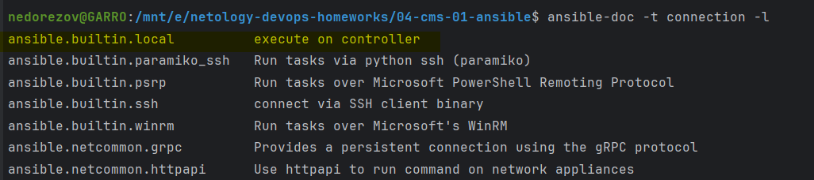

10. В `prod.yml` добавьте новую группу хостов с именем `local`, в ней разместите localhost с необходимым типом подключения.
> #### Ответ:
> Изменения отразил в [playbook/inventory/prod.yml](playbook/inventory/prod.yml)

11. Запустите playbook на окружении `prod.yml`. При запуске `ansible` должен запросить у вас пароль. 
Убедитесь, что факты `some_fact` для каждого из хостов определены из верных `group_vars`.
> #### Ответ:
> При запуске на prod для `localhost` значение `some_fact` применилось от группы `all`
> 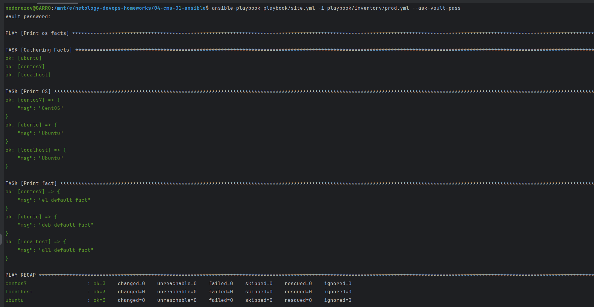

12. Заполните `README.md` ответами на вопросы. Сделайте `git push` в ветку `master`. 
В ответе отправьте ссылку на ваш открытый репозиторий с изменённым `playbook` и заполненным `README.md`.
13. Предоставьте скриншоты результатов запуска команд.

------

## Задача 2*

1. При помощи `ansible-vault` расшифруйте все зашифрованные файлы с переменными.
> #### Ответ:
> 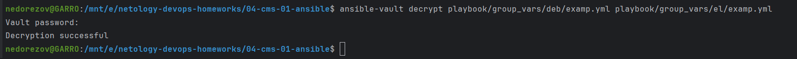

2. Зашифруйте отдельное значение `PaSSw0rd` для переменной `some_fact` паролем `netology`. Добавьте полученное значение в `group_vars/all/examp.yml`.
3. Запустите `playbook`, убедитесь, что для нужных хостов применился новый `fact`.
4. Добавьте новую группу хостов `fedora`, самостоятельно придумайте для неё переменную. 
В качестве образа можно использовать [этот вариант](https://hub.docker.com/r/pycontribs/fedora).
5. Напишите скрипт на bash: автоматизируйте поднятие необходимых контейнеров, запуск ansible-playbook и остановку контейнеров.
6. Все изменения должны быть зафиксированы и отправлены в ваш личный репозиторий.

------

