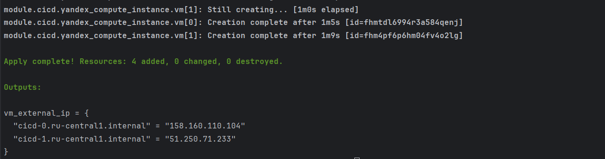
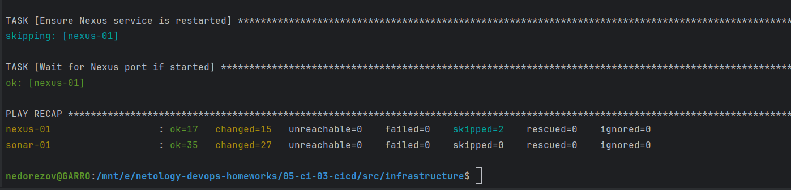
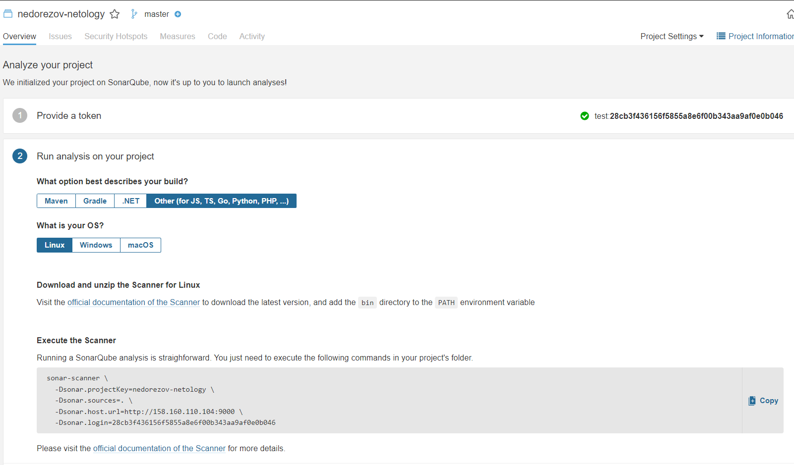
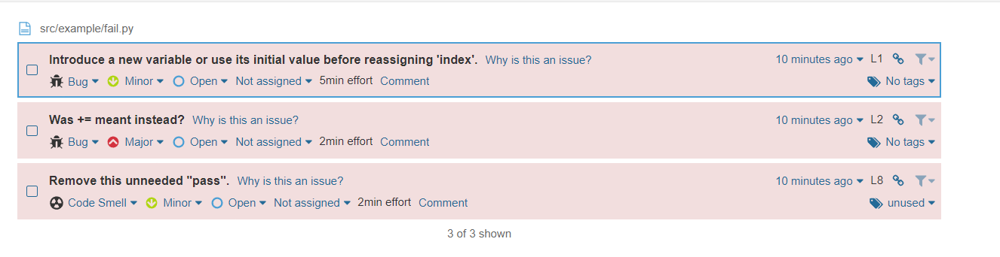
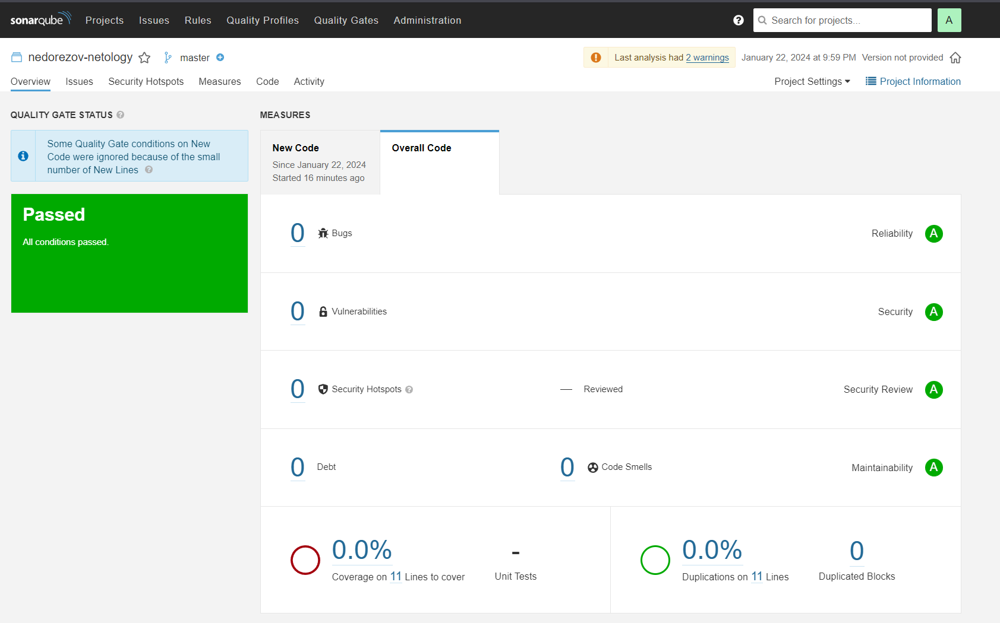
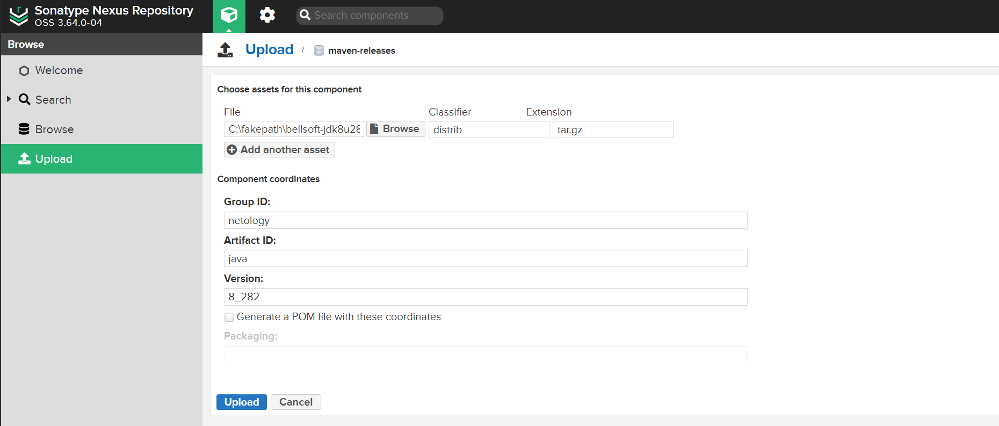
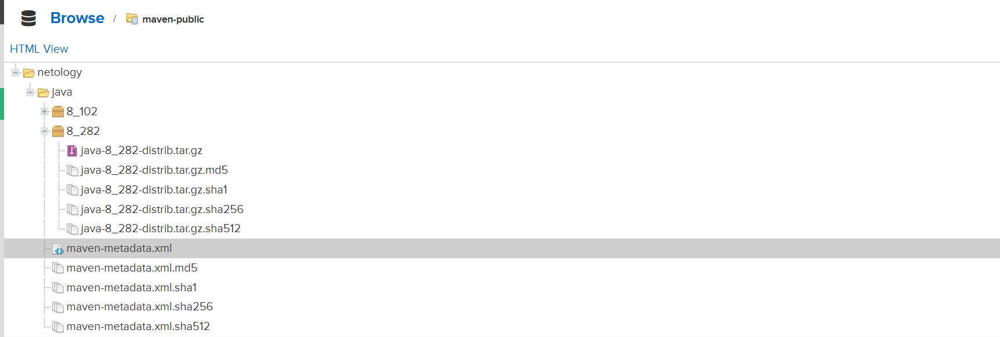
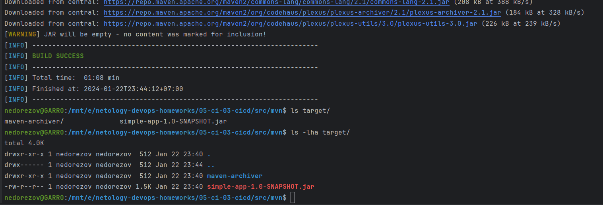

# Домашнее задание к занятию "Процессы CI/CD"

## Студент: Александр Недорезов

---

> ## Подготовка к выполнению
> 
> 1. Создайте два VM в Yandex Cloud с параметрами: 2CPU 4RAM Centos7 (остальное по минимальным требованиям).
> 2. Пропишите в [inventory](./src/infrastructure/inventory/cicd/hosts.yml) [playbook](./src/infrastructure/site.yml) созданные хосты.
> 3. Добавьте в [files](./src/infrastructure/files/) файл со своим публичным ключом (id_rsa.pub). Если ключ называется иначе — найдите таску в плейбуке, которая использует id_rsa.pub имя, и исправьте на своё.
> 4. Запустите playbook, ожидайте успешного завершения.
> 5. Проверьте готовность SonarQube через [браузер](http://localhost:9000).
> 6. Зайдите под admin\admin, поменяйте пароль на свой.
> 7. Проверьте готовность Nexus через [бразуер](http://localhost:8081).
> 8. Подключитесь под admin\admin123, поменяйте пароль, сохраните анонимный доступ.
> 
> ## Знакомство с SonarQube
> 
> ### Основная часть
> 
> 1. Создайте новый проект, название произвольное.
> 2. Скачайте пакет sonar-scanner, который вам предлагает скачать SonarQube.
> 3. Сделайте так, чтобы binary был доступен через вызов в shell (или поменяйте переменную PATH, или любой другой, удобный вам способ).
> 4. Проверьте `sonar-scanner --version`.
> 5. Запустите анализатор против кода из директории [example](./src/example) с дополнительным ключом `-Dsonar.coverage.exclusions=fail.py`.
> 6. Посмотрите результат в интерфейсе.
> 7. Исправьте ошибки, которые он выявил, включая warnings.
> 8. Запустите анализатор повторно — проверьте, что QG пройдены успешно.
> 9. Сделайте скриншот успешного прохождения анализа, приложите к решению ДЗ.

### Ответ:
С помощью [terraform](./terraform) поднял необходимые ВМ:

[playbook](./src/infrastructure/site.yml) отработал успешно:

В SonarQube создал проект и установил sonar-scanner:

Анализатор показал следующие warnings:

Исправил ошибки в коде, итоговый: [fail.py](./src/example/fail.py). Повторный отчет анализатора без ошибок:

---

## Знакомство с Nexus

> ### Основная часть
> 
> 1. В репозиторий `maven-public` загрузите артефакт с GAV-параметрами:
> 
>  *    groupId: netology;
>  *    artifactId: java;
>  *    version: 8_282;
>  *    classifier: distrib;
>  *    type: tar.gz.
>    
> 2. В него же загрузите такой же артефакт, но с version: 8_102.
> 3. Проверьте, что все файлы загрузились успешно.
> 4. В ответе пришлите файл `maven-metadata.xml` для этого артефекта.

### Ответ:
Загрузил артефакты в Liberica JDK нужной версии, файл с [maven-metadata.xml](maven-metadata.xml)

---

## Знакомство с Maven

> ### Подготовка к выполнению
> 
> 1. Скачайте дистрибутив с [maven](https://maven.apache.org/download.cgi).
> 2. Разархивируйте, сделайте так, чтобы binary был доступен через вызов в shell (или поменяйте переменную PATH, или любой другой, удобный вам способ).
> 3. Удалите из `apache-maven-<version>/conf/settings.xml` упоминание о правиле, отвергающем HTTP- соединение — раздел mirrors —> id: my-repository-http-unblocker.
> 4. Проверьте `mvn --version`.
> 5. Заберите директорию [mvn](./src/mvn) с pom.
> 
> ### Основная часть
> 
> 1. Поменяйте в `pom.xml` блок с зависимостями под ваш артефакт из первого пункта задания для Nexus (java с версией 8_282).
> 2. Запустите команду `mvn package` в директории с `pom.xml`, ожидайте успешного окончания.
> 3. Проверьте директорию `~/.m2/repository/`, найдите ваш артефакт.
> 4. В ответе пришлите исправленный файл `pom.xml`.

### Ответ:
Установил Maven, проверил доступность.

Изменил [pom.xml](src/mvn/pom.xml), запустил `mvn package`, сборка прошла успешно:

---