# Домашнее задание к занятию 12 «GitLab»

## Подготовка к выполнению

> 1. Или подготовьте к работе Managed GitLab от yandex cloud [по инструкции](https://cloud.yandex.ru/docs/managed-gitlab/operations/instance/instance-create) .
> Или создайте виртуальную машину из публичного образа [по инструкции](https://cloud.yandex.ru/marketplace/products/yc/gitlab ) .
> 2. Создайте виртуальную машину и установите на нее gitlab runner, подключите к вашему серверу gitlab  [по инструкции](https://docs.gitlab.com/runner/install/linux-repository.html) .
> 
> 3. (* Необязательное задание повышенной сложности. )  Если вы уже знакомы с k8s попробуйте выполнить задание, запустив gitlab server и gitlab runner в k8s  [по инструкции](https://cloud.yandex.ru/docs/tutorials/infrastructure-management/gitlab-containers). 
> 
> 4. Создайте свой новый проект.
> 5. Создайте новый репозиторий в GitLab, наполните его [файлами](./repository).
> 6. Проект должен быть публичным, остальные настройки по желанию.

#### Примечание:

_Хотел выполнить все в k8s с повышенной сложностью, но наткнулся на ряд ограничений, которые пока не смог преодолеть._ 
_Managed Gitlab создается сразу с самоподписанным tls-сертификатом доменной зоны *.gitlab.yandexcloud.com, изменить который нельзя._ 
_Следовательно, запустить раннер в k8s из маркетплейса не получилось из-за ошибки TLS, т.к. в SAN серта не указан нужный dns. Выпустить lets encrypt сертификат не получилось, т.к. подтвердить владение доменной зоной нет возможности._

_Как правильнее это настроить? Прокси с TLS-терминированием на своем сертификате? "Production way" ли это?_

#### Ответ:
Создал ВМ GitLab из публичного образа, а также ВМ с раннером. Установил раннер и зарегистрировал:
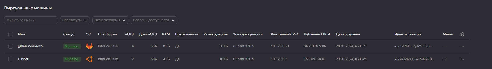

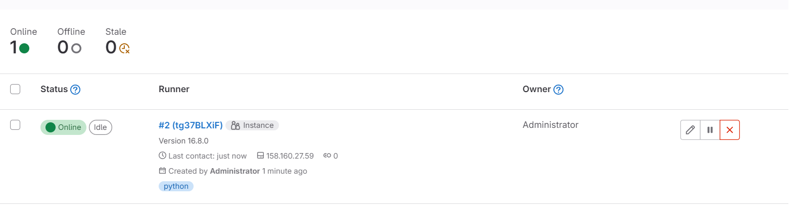

Конфигурация раннера: [/etc/gitlab-runner/config.toml](runner.config.toml).
Добавил concurrency и docker socket.

Создал YC Container Registry, прописал в глобальных переменных GitLab доступ к нему: 
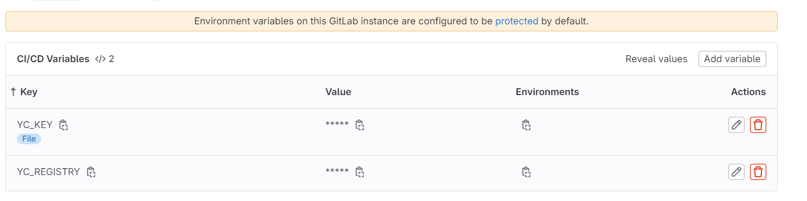

Создал проект с приложением, а также отдельный проект с пайплайном [python.gitlab-ci.yml](python.gitlab-ci.yml)
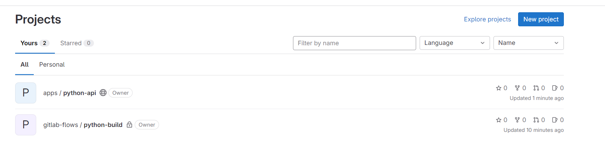
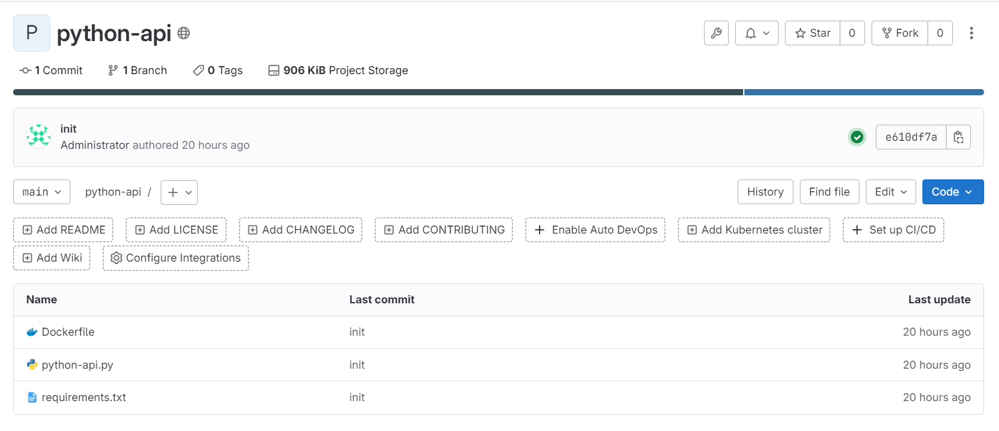

Настройки для внешнего конфигурационного файла CI/CD:
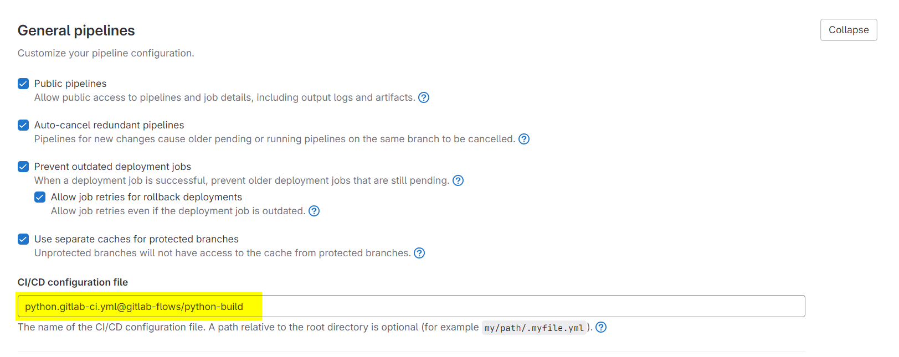

## Основная часть

### DevOps

> В репозитории содержится код проекта на Python. Проект — RESTful API сервис. Ваша задача — автоматизировать сборку образа с выполнением python-скрипта:
> 
> 1. Образ собирается на основе [centos:7](https://hub.docker.com/_/centos?tab=tags&page=1&ordering=last_updated).
> 2. Python версии не ниже 3.7.
> 3. Установлены зависимости: `flask` `flask-jsonpify` `flask-restful`.
> 4. Создана директория `/python_api`.
> 5. Скрипт из репозитория размещён в /python_api.
> 6. Точка вызова: запуск скрипта.
> 7. При комите в любую ветку должен собираться docker image с форматом имени hello:gitlab-$CI_COMMIT_SHORT_SHA . Образ должен быть выложен в Gitlab registry или yandex registry.   

#### Ответ:
В проекте приложения лежат: 
- [python-api.py](repository/python-api.py) - скрипт для запуска
- [requirements.txt](repository/requirements.txt) - файл с зависимостями python
- [Dockerfile](repository/Dockerfile) - инструкция для сборки образа Docker. Т.к. python нужен >3.7, а у нас Centos:7, нужно собирать дистрибутив из исходников.  
Чтобы не раздувать размеры слоев образа, постарался использовать отдельный builder и упорядочил слои, изменения кода будут затрагивать только последний слой. 

Пайплайн: [python.gitlab-ci.yml](python.gitlab-ci.yml)  
Первый коммит в репозиторий и прогон пайплайна успешны.
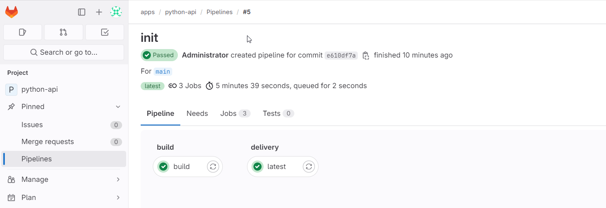

Лог: [pipeline.log](pipeline.log)

### Product Owner

> Вашему проекту нужна бизнесовая доработка: нужно поменять JSON ответа на вызов метода GET `/rest/api/get_info`, необходимо создать Issue в котором указать:
> 
> 1. Какой метод необходимо исправить.
> 2. Текст с `{ "message": "Already started" }` на `{ "message": "Running"}`.
> 3. Issue поставить label: feature.

#### Ответ:

Создал issue: 
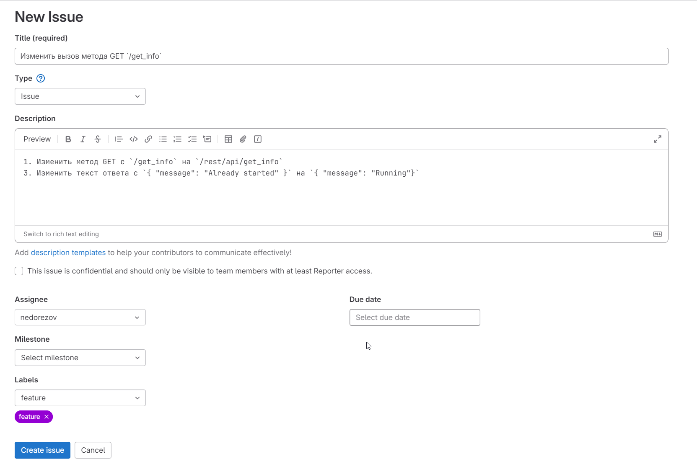

### Developer

> Пришёл новый Issue на доработку, вам нужно:
> 
> 1. Создать отдельную ветку, связанную с этим Issue.
> 2. Внести изменения по тексту из задания.
> 3. Подготовить Merge Request, влить необходимые изменения в `master`, проверить, что сборка прошла успешно.

#### Ответ:
Создал новую ветку, внес изменения в код, влил изменения в `main`.  
Успешный прогон Pipeline:
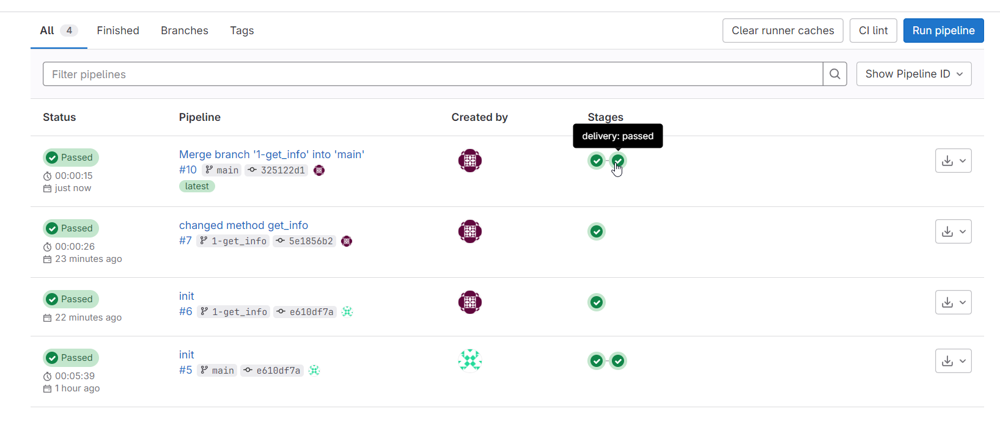

Лог Pipeline изменений
\
Running with gitlab-runner 16.8.0 (c72a09b6)
  on runner tg37BLXiF, system ID: s_1fcf7832a801
section_start:1706626756:prepare_executorPreparing the "docker" executor
Using Docker executor with image docker:24 ...
Pulling docker image docker:24 ...
Using docker image sha256:cf839aaaca3c3f8fac9f63be48dfc4f94d554eeccbf9a9f5100352f5fcfcf52d for docker:24 with digest docker@sha256:c68702a0a7ac43d6d69b1896ca55f160d5ac136e48eddfff71e8b8e5cff36494 ...
section_end:1706626770:prepare_executorsection_start:1706626770:prepare_scriptPreparing environment
Running on runner-tg37blxif-project-3-concurrent-0 via runner...
section_end:1706626772:prepare_scriptsection_start:1706626772:get_sourcesGetting source from Git repository
Fetching changes with git depth set to 20...
Reinitialized existing Git repository in /builds/apps/python-api/.git/
Checking out 5e1856b2 as detached HEAD (ref is 1-get_info)...

Skipping Git submodules setup
section_end:1706626773:get_sourcessection_start:1706626773:step_scriptExecuting "step_script" stage of the job script
Using docker image sha256:cf839aaaca3c3f8fac9f63be48dfc4f94d554eeccbf9a9f5100352f5fcfcf52d for docker:24 with digest docker@sha256:c68702a0a7ac43d6d69b1896ca55f160d5ac136e48eddfff71e8b8e5cff36494 ...
$ cat $YC_KEY | docker login --username json_key --password-stdin cr.yandex
WARNING! Your password will be stored unencrypted in /root/.docker/config.json.
Configure a credential helper to remove this warning. See
https://docs.docker.com/engine/reference/commandline/login/#credentials-store

Login Succeeded
$ docker build -t $IMAGE_BUILD .
#0 building with "default" instance using docker driver

#1 [internal] load build definition from Dockerfile
#1 transferring dockerfile: 1.24kB done
#1 DONE 0.1s

#2 [internal] load metadata for docker.io/library/centos:7
#2 DONE 1.6s

#3 [internal] load .dockerignore
#3 transferring context: 2B done
#3 DONE 0.1s

#4 [stage-1 1/9] FROM docker.io/library/centos:7@sha256:be65f488b7764ad3638f236b7b515b3678369a5124c47b8d32916d6487418ea4
#4 DONE 0.0s

#5 [internal] load build context
#5 transferring context: 516B done
#5 DONE 0.1s

#6 [stage-1 6/9] WORKDIR /python_api
#6 CACHED

#7 [builder 3/4] WORKDIR /Python-3.9.18
#7 CACHED

#8 [builder 4/4] RUN ./configure --enable-optimizations &&     make altinstall &&     cd ../ && rm -rf /Python-3.9.18
#8 CACHED

#9 [stage-1 2/9] COPY --from=builder /usr/local/include/python3.9/ /usr/local/include/python3.9/
#9 CACHED

#10 [stage-1 3/9] COPY --from=builder /usr/local/lib/python3.9/ /usr/local/lib/python3.9/
#10 CACHED

#11 [builder 2/4] RUN yum install gcc openssl-devel bzip2-devel libffi libffi-devel wget make -y &&     wget https://www.python.org/ftp/python/3.9.18/Python-3.9.18.tgz  &&     tar -xzf Python-3.9.18.tgz &&      rm Python-3.9.18.tgz &&     yum clean all &&      rm -rf /var/cache/yum/*
#11 CACHED

#12 [stage-1 4/9] COPY --from=builder /usr/local/bin/python3.9 /usr/local/bin/python3.9
#12 CACHED

#13 [stage-1 7/9] COPY --chown=app requirements.txt requirements.txt
#13 CACHED

#14 [stage-1 5/9] RUN groupadd --gid 1001 --system app &&      adduser --uid 1001 --gid app --create-home --system app
#14 CACHED

#15 [stage-1 8/9] RUN python3.9 -m pip install -r requirements.txt
#15 CACHED

#16 [stage-1 9/9] COPY --chown=app python-api.py python-api.py
#16 DONE 0.2s

#17 exporting to image
#17 exporting layers 0.1s done
#17 writing image sha256:c9b4c88ce085219636f6570cc4ec9a87b3c36ab6688838323143ca1ecd094921 0.0s done
#17 naming to cr.yandex/crpt0hfp052rgncun7nr/python-api/hello:gitlab-5e1856b2 0.0s done
#17 DONE 0.2s
WARNING: current commit information was not captured by the build: git was not found in the system: exec: "git": executable file not found in $PATH
$ docker push $IMAGE_BUILD
The push refers to repository [cr.yandex/crpt0hfp052rgncun7nr/python-api/hello]
fc73eb2c1c9d: Preparing
e9b670dd5997: Preparing
75fac6a90109: Preparing
92e3afd96bfe: Preparing
5e8af367c070: Preparing
0e362dc43867: Preparing
048f4bbbf2c3: Preparing
6881461391d7: Preparing
174f56854903: Preparing
0e362dc43867: Waiting
048f4bbbf2c3: Waiting
6881461391d7: Waiting
174f56854903: Waiting
75fac6a90109: Layer already exists
92e3afd96bfe: Layer already exists
e9b670dd5997: Layer already exists
5e8af367c070: Layer already exists
0e362dc43867: Layer already exists
6881461391d7: Layer already exists
174f56854903: Layer already exists
048f4bbbf2c3: Layer already exists
fc73eb2c1c9d: Pushed
gitlab-5e1856b2: digest: sha256:0d1f145c3134a0558a020adbc983a162a2b24029f127da05c5d3fd2dbd6aac8f size: 2202
section_end:1706626783:step_scriptsection_start:1706626783:cleanup_file_variablesCleaning up project directory and file based variables
section_end:1706626784:cleanup_file_variablesJob succeeded

Видно, что изменился только последний слой image `stage-1 9/9`

### Tester

> Разработчики выполнили новый Issue, необходимо проверить валидность изменений:
> 
> 1. Поднять докер-контейнер с образом `python-api:latest` и проверить возврат метода на корректность.
> 2. Закрыть Issue с комментарием об успешности прохождения, указав желаемый результат и фактически достигнутый.

#### Ответ:

Проверил наличие образов в Registry:
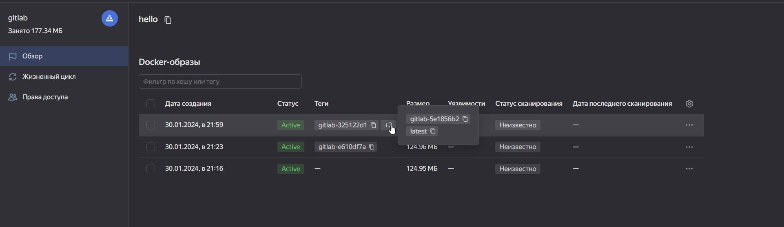

Выполнил pull образа, запустил и обратился по api:
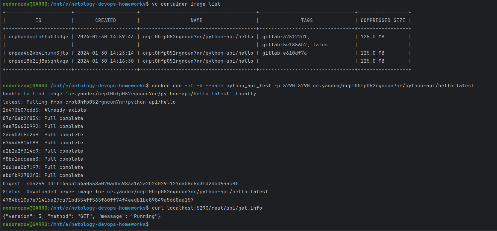

## Итог

В качестве ответа пришлите подробные скриншоты по каждому пункту задания:

- файл [gitlab-ci.yml](python.gitlab-ci.yml);
- [Dockerfile](repository/Dockerfile); 
- лог успешного [выполнения пайплайна](pipeline.log);
- решённый Issue.
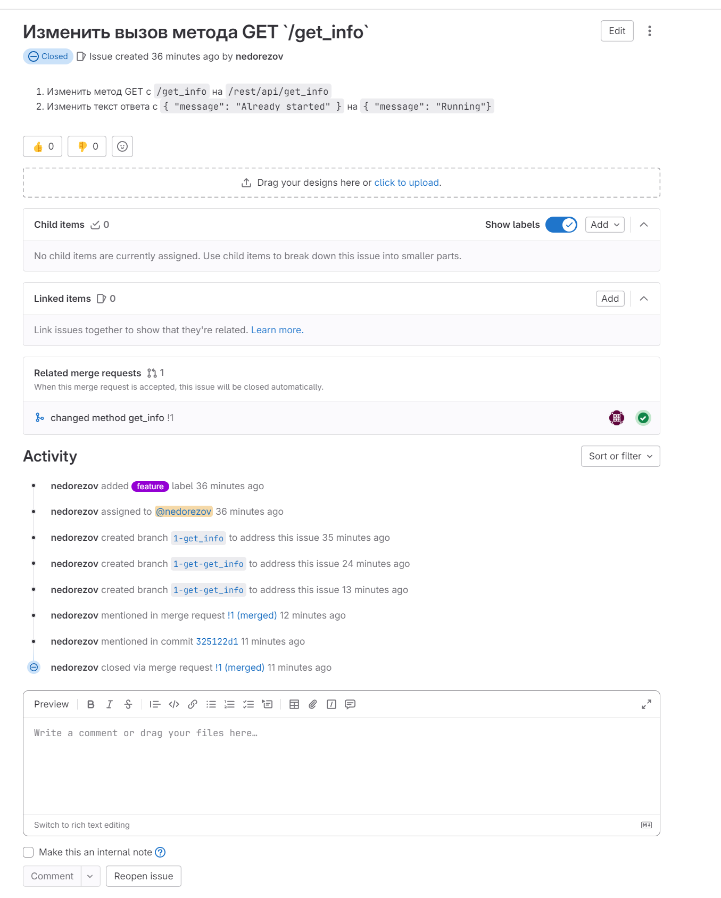
