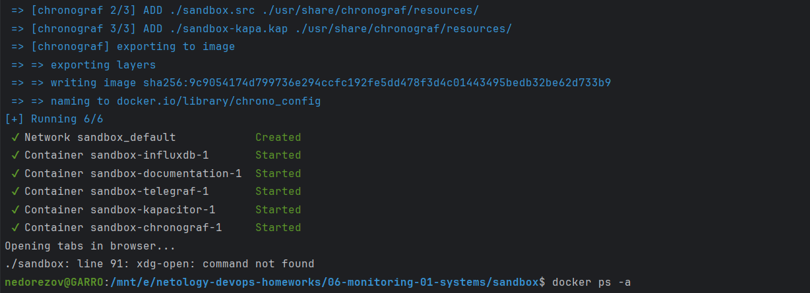
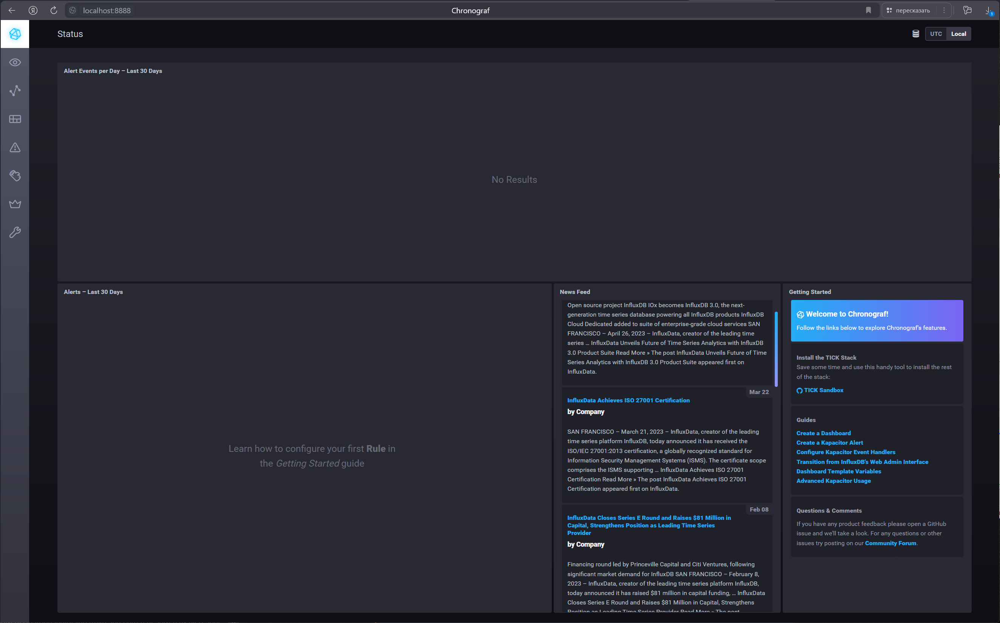
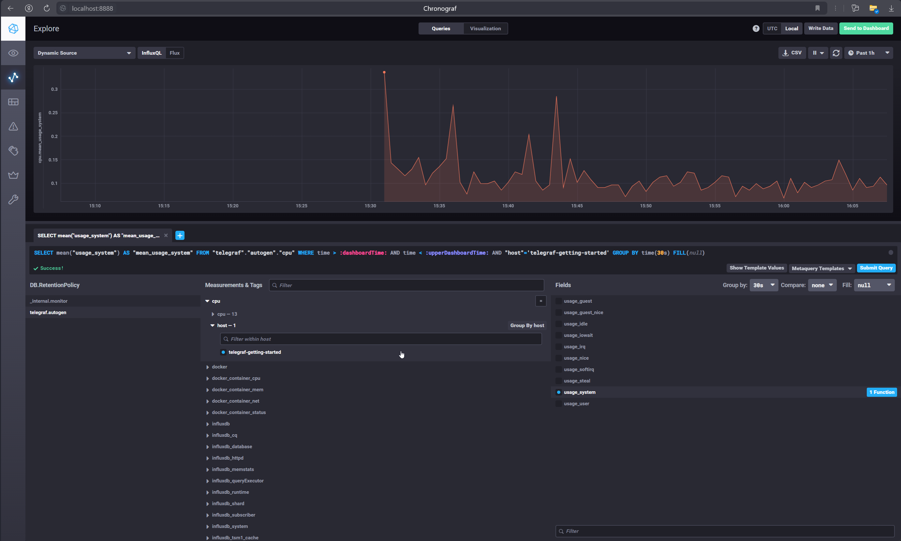
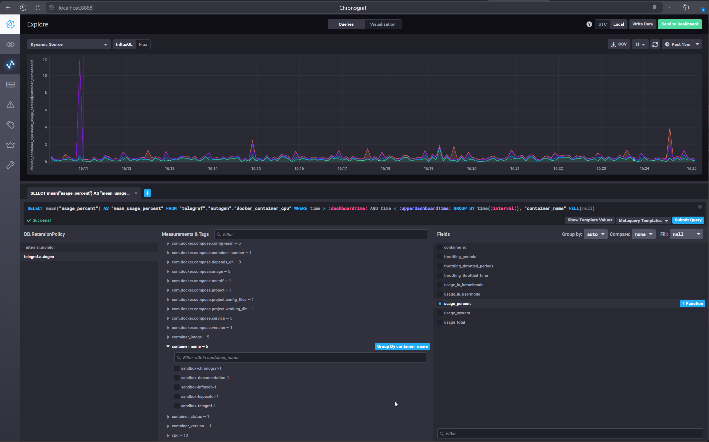
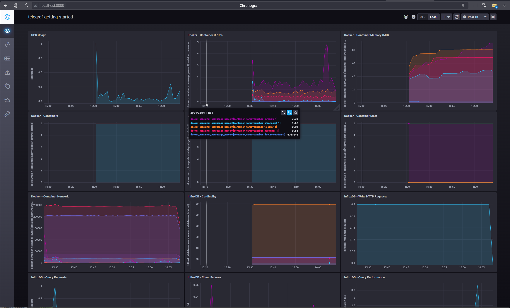

# Домашнее задание к занятию "13. Системы мониторинга"
## Студент: Александр Недорезов

## Обязательные задания

1. Вас пригласили настроить мониторинг на проект. На онбординге вам рассказали, что проект представляет собой 
платформу для вычислений с выдачей текстовых отчетов, которые сохраняются на диск. Взаимодействие с платформой 
осуществляется по протоколу http. Также вам отметили, что вычисления загружают ЦПУ. Какой минимальный набор метрик вы
выведите в мониторинг и почему?

> #### Ответ:
> Правильнее придерживаться основны основных подходов к сбору метрик: USE, RED, LTES (4 golden signals из Google SRE Book). Они отличаются по целям мониторинга и, следовательно, включают разный набор метрик.  
> Для веб-приложений лучше подходит LTES, но каждый отдельный компонент следует мониторить, основываясь на здравом смысле. 
> Я бы предложил использовать комбинацию подходов USE и 4 Golden Signals:
> - `Latency` - время отклика HTTP-запросов пользователей, а также задержка read/write операций на диске.
> - `Traffic` - количество запросов к компоненту. Для веб-сервера это могут http-запросы, для базы данных — транзакции и т.д.
> - `Errors` - частота ошибок или количество ошибок. Это могут быть некорректные коды ответа, исключения в приложении и т.д.
> - `Utilization` - время или процент использования ресурса, занятого «полезной работой» (CPU, RAM, HDD, FS, inodes), чтобы отслеживать состояние дисков и нагрузку на ЦПУ и другие ресурсы при вычислениях.
> - `Saturation` - вводится для ситуации, когда utilization 100 % и работа откладывается в очередь. Например, большое количество http-запросов единовременно, отложенные вычисления в БД.

---

2. Менеджер продукта посмотрев на ваши метрики сказал, что ему непонятно что такое RAM/inodes/CPUla. Также он сказал, 
что хочет понимать, насколько мы выполняем свои обязанности перед клиентами и какое качество обслуживания. Что вы 
можете ему предложить?

> #### Ответ:
> Я бы предложил ввести и отслеживать следующие показатели:
> * `SLI` (Service level indicators) — набор ключевых метрик, по которым можно определить жизненный статус сервиса, его производительность, «удовлетворенность» конечных пользователей работой сервиса. Например, в SLI может входить количество 500-х ошибок или количество активных пользователей.
> * `SLA` (Service level agreement) — так называемое «соглашение об уровне доступности сервиса», которое определяется как внешнее обязательство перед конечным пользователем или клиентом. Например, установленный SLA техподдержки в 15 минут — время реакции на запрос или инцидент клиента вне зависимости от внутренних обстоятельств.
> * `SLO` (Service level objectives) — набор целевых, «желаемых» значений SLI, выход за пределы которых может привести к нарушению SLA конкретного сервиса или компонента. Максимально допустимое отклонение от «идеальных» показателей в данной концепции называется Error Budget (право на ошибку). Как пример, это может быть: максимальное количество 500-х ошибок за 5 минут, максимальное время недоступности веб-страницы, максимально допустимая нагрузка на процессор и т д.
> * `MTBF` (средняя наработка на отказ) — это среднее время между исправляемыми сбоями технологического продукта.
> * `MTTR` (среднее время восстановления или среднее время стабилизации) — это среднее время восстановления после сбоя работы продукта или системы.

---

3. Вашей DevOps команде в этом году не выделили финансирование на построение системы сбора логов. Разработчики в свою 
очередь хотят видеть все ошибки, которые выдают их приложения. Какое решение вы можете предпринять в этой ситуации, 
чтобы разработчики получали ошибки приложения?

> #### Ответ:
> Под задачу разработчиков можно внедрить Sentry - систему перехватывания ошибок от приложений в реальном времени, для диагностики багов на каждом из этапов CI/CD.
> Но отсутствие системы мониторинга несет риски в первую очередь для бизнеса, т.к. при отсутствии данных от объектов управления невозможно оценить состояние ключевых показателей из п.2. 
> Для организации комплексной системы мониторинга, повысить Observability инфраструктуры, можно использовать Grafana-стек, либо ELK+Prometheus+Grafana, TICK. Главное - написать качественные алерты.

---

4. Вы, как опытный SRE, сделали мониторинг, куда вывели отображения выполнения SLA=99% по http кодам ответов. 
Вычисляете этот параметр по следующей формуле: summ_2xx_requests/summ_all_requests. Данный параметр не поднимается выше 
70%, но при этом в вашей системе нет кодов ответа 5xx и 4xx. Где у вас ошибка?

> #### Ответ:
> 
> При расчете показателя к положительным ответам также относится редирект (3хх) и формула должна выглядеть как `(summ_2xx_requests + summ_3xx_requests)/(summ_all_requests)`.  

---

5. Опишите основные плюсы и минусы pull и push систем мониторинга.

> #### Ответ:
> 
> _Push система мониторинга_
> 
> - Плюсы
>   - Упрощенное мультитенанси и репликация - легче настроить отправку данных в разные системы
>   - Гибкая настройка отправки пакетов данных с метриками, т.е. возможны relabel, drop, filter, сжатие пакетов и т.д.
>   - Можно использовать UDP — это менее затратный способ передачи данных
>   - Проще безопасность - “защищаем” центральную ноду так, чтобы только приложения могли к ней пробиться, и больше ничего открывать не нужно.
>   - Меньше нагрузка - агенты по определению распределены по нодам, и обычно нагрузка на центральную ноду всё равно меньше, чем при pull.
> - Минусы
>   - Риск потери части данных при отправке через UDP
>   - Настройка каждого агента отдельно
>   - Сложный траблшутинг в случае недоступности ноды - упал агент, весь сервер, неполадки с сетью или приложение вообще переехало?..
> 
> _Pull система мониторинга_
> 
> - Плюсы
>   - Единая точка конфигурирования, можно централизованно задать, какие агенты опрашивать
>   - Можно настроить единый proxy до всех агентов с TLS для взаимодействия с сервером (но и для push можно настроить единый load balancer с TLS-терминированием, тот же NGINX)
>   - Упрощённая отладка получения данных с агентов
>   - Легче контролировать поток данных, их подлинность
>   - Отлично показывает себя в K8s, когда количество сущностей, которые необходимо мониторить, изменяется с течением времени
> - Минусы
>   - Потеря всех данных при отключениях сервера мониторинга или проблемах с сетью
>   - Для Pull модели система мониторинга должна иметь возможность “достучаться” до приложения. Если оно за NATом, то использовать Pull становится сложно, ведь нужно как-то прокидывать порт. А также не забыть про безопасность и настроить доступ к порту только для сервера мониторинга.
>   - Сложно использовать с короткоживущими приложениями - когда приложение запускается, что-то делает и завершается. Например, импортирует данные статистики партнёра.

---

6. Какие из ниже перечисленных систем относятся к push модели, а какие к pull? А может есть гибридные?

> #### Ответ:
> 
> - `Prometheus` - гибрид, изначально pull-модель, но теперь доступен push с помощью Pushgateway;
> - `TICK` - push модель;
> - `Zabbix` - гибрид, работает по pull и push модели, в зависимости от режима агента (Active-Passive);
> - `VictoriaMetrics` - изначально это долгосрочное хранилище для Prometheus, поэтому работало по модели Push (remote_write). Но сейчас у них есть vmagent, который умеет сам скрейпить метрики (pull), а также принимать мтерики извне (Push) и передавать на хранение в VM-кластер. Но push-модель взаимодействия с компонентами Victoriametrics это не поменяло;
> - `Nagios` - push модель, т.к. использует агенты, которые установлены на компонентах для отслеживания и пушат данные на Nagios Server;

---

7. Склонируйте себе [репозиторий](https://github.com/influxdata/sandbox/tree/master) и запустите TICK-стэк, 
используя технологии docker и docker-compose.

В виде решения на это упражнение приведите скриншот веб-интерфейса ПО chronograf (`http://localhost:8888`). 

P.S.: если при запуске некоторые контейнеры будут падать с ошибкой - проставьте им режим `Z`, например
`./data:/var/lib:Z`

> #### Ответ:
> 
> Запуск sandbox-комплекса:
> 
> 
> Интерфейс:
> 

---

8. Перейдите в веб-интерфейс Chronograf (http://localhost:8888) и откройте вкладку Data explorer.
        
    - Нажмите на кнопку Add a query
    - Изучите вывод интерфейса и выберите БД telegraf.autogen
    - В `measurments` выберите cpu->host->telegraf-getting-started, а в `fields` выберите usage_system. Внизу появится график утилизации cpu.
    - Вверху вы можете увидеть запрос, аналогичный SQL-синтаксису. Поэкспериментируйте с запросом, попробуйте изменить группировку и интервал наблюдений.

Для выполнения задания приведите скриншот с отображением метрик утилизации cpu из веб-интерфейса.

> #### Ответ:
> 
> ```sql
> SELECT mean("usage_system") AS "mean_usage_system" FROM "telegraf"."autogen"."cpu" WHERE time > :dashboardTime: AND time < :upperDashboardTime: AND "host"='telegraf-getting-started' GROUP BY time(30s) FILL(null)
> ```
> 

---

9. Изучите список [telegraf inputs](https://github.com/influxdata/telegraf/tree/master/plugins/inputs). 
Добавьте в конфигурацию telegraf следующий плагин - [docker](https://github.com/influxdata/telegraf/tree/master/plugins/inputs/docker):
```
[[inputs.docker]]
  endpoint = "unix:///var/run/docker.sock"
```

Дополнительно вам может потребоваться донастройка контейнера telegraf в `docker-compose.yml` дополнительного volume и 
режима privileged:
```
  telegraf:
    image: telegraf:1.4.0
    privileged: true
    volumes:
      - ./etc/telegraf.conf:/etc/telegraf/telegraf.conf:Z
      - /var/run/docker.sock:/var/run/docker.sock:Z
    links:
      - influxdb
    ports:
      - "8092:8092/udp"
      - "8094:8094"
      - "8125:8125/udp"
```

После настройке перезапустите telegraf, обновите веб интерфейс и приведите скриншотом список `measurments` в 
веб-интерфейсе базы telegraf.autogen. Там должны появиться метрики, связанные с docker.

Факультативно можете изучить какие метрики собирает telegraf после выполнения данного задания.

> #### Ответ:
> 
> Плагин docker и сбор метрик уже настроены в sandbox по умолчанию, список `measurements`:
> 
> 
> В представлении хоста можно посмотреть уже настроенный дефолтный набор графиков вместе с Docker-метриками. Здесь можно наблюдать использование CPU и Memory в разрезе контейнеров, статус контейнеров, использование сетевого трафика и т.д.
> 