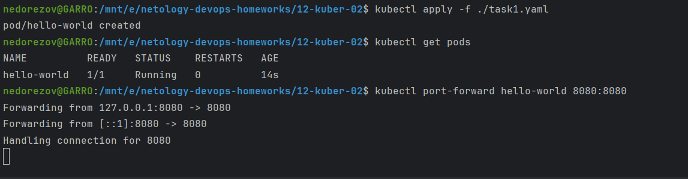
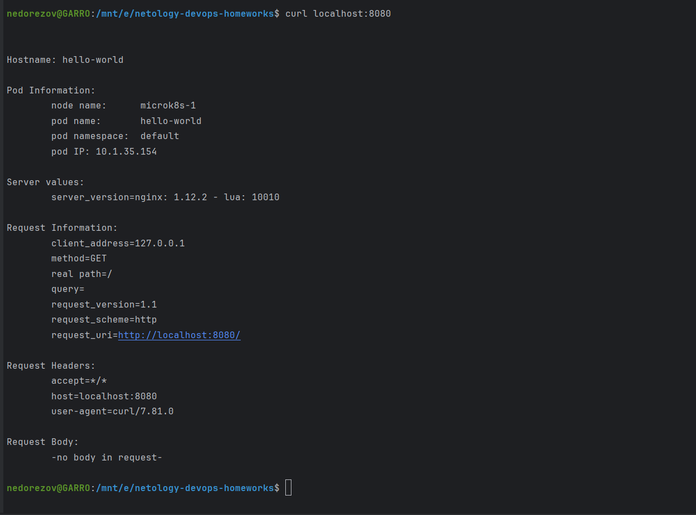
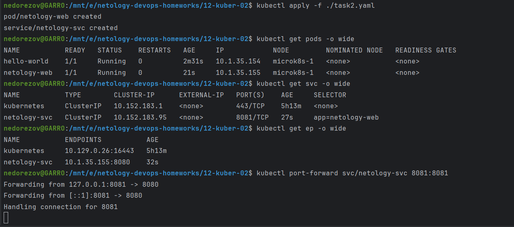
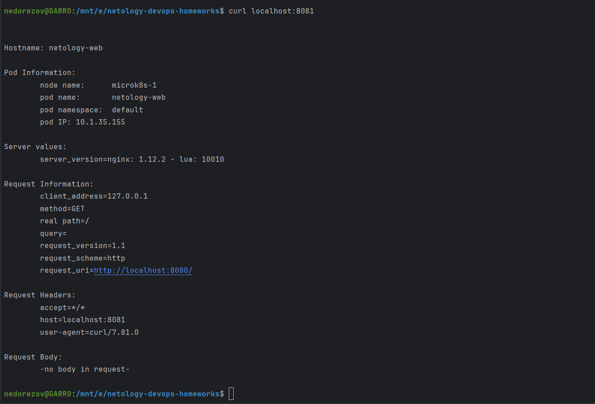

# Домашнее задание к занятию «Базовые объекты K8S»
## Студент: Александр Недорезов

### Цель задания

В тестовой среде для работы с Kubernetes, установленной в предыдущем ДЗ, необходимо развернуть Pod с приложением и подключиться к нему со своего локального компьютера. 

------
<details>
<summary>Чеклист готовности к домашнему заданию</summary>

1. Установленное k8s-решение (например, MicroK8S).
2. Установленный локальный kubectl.
3. Редактор YAML-файлов с подключенным Git-репозиторием.

</details>

------

<details>
<summary>Инструменты и дополнительные материалы, которые пригодятся для выполнения задания</summary>

### Инструменты и дополнительные материалы, которые пригодятся для выполнения задания

1. Описание [Pod](https://kubernetes.io/docs/concepts/workloads/pods/) и примеры манифестов.
2. Описание [Service](https://kubernetes.io/docs/concepts/services-networking/service/).

</details>

------

### Задание 1. Создать Pod с именем hello-world

> 1. Создать манифест (yaml-конфигурацию) Pod.
> 2. Использовать image - gcr.io/kubernetes-e2e-test-images/echoserver:2.2.
> 3. Подключиться локально к Pod с помощью `kubectl port-forward` и вывести значение (curl или в браузере).

### Решение:

1. Написал манифест: [task1.yaml](./task1.yaml).  
В манифесте дополнительно обозначил переменные окружения, необходимые для корректного вывода информации в шаблоне nginx контейнера echoserver
2. Применил манифест, вывел информацию о подах и выполнил port-forward к поду:
    ```bash
    kubectl apply -f ./task1.yaml
    kubectl get pods
    kubectl port-forward hello-world 8080:8080
    ```
   
3. Подключился через curl, в ответе сервера видно информацию о поде `hello-world`: 
   

------

### Задание 2. Создать Service и подключить его к Pod

> 1. Создать Pod с именем netology-web.
> 2. Использовать image — gcr.io/kubernetes-e2e-test-images/echoserver:2.2.
> 3. Создать Service с именем netology-svc и подключить к netology-web.
> 4. Подключиться локально к Service с помощью `kubectl port-forward` и вывести значение (curl или в браузере).

### Решение:

1. Написал манифест: [task2.yaml](./task2.yaml).
2. Применил конфигурацию, успешно создался под, сервис и эндпоинт. Вывел информацию о ресурсах и выполнил port-forward к сервису `netology-srv`:
    ```bash
    kubectl apply -f ./task2.yaml
    kubectl get pods -o wide
    kubectl get srv -o wide
    kubectl get ep -o wide
    kubectl port-forward svc/netology-svc 8081:8081
    ```
   
3. Подключился через curl, в ответе сервера видно информацию о поде `netology-web`: 
   

------

### Правила приёма работы

1. Домашняя работа оформляется в своем Git-репозитории в файле README.md. Выполненное домашнее задание пришлите ссылкой на .md-файл в вашем репозитории.
2. Файл README.md должен содержать скриншоты вывода команд `kubectl get pods`, а также скриншот результата подключения.
3. Репозиторий должен содержать файлы манифестов и ссылки на них в файле README.md.

------

### Критерии оценки
Зачёт — выполнены все задания, ответы даны в развернутой форме, приложены соответствующие скриншоты и файлы проекта, в выполненных заданиях нет противоречий и нарушения логики.

На доработку — задание выполнено частично или не выполнено, в логике выполнения заданий есть противоречия, существенные недостатки.