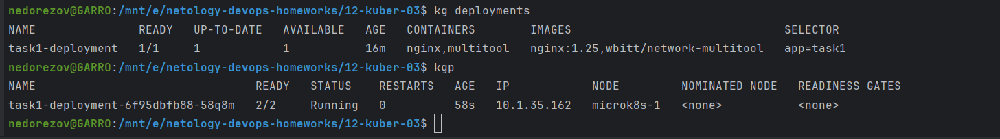
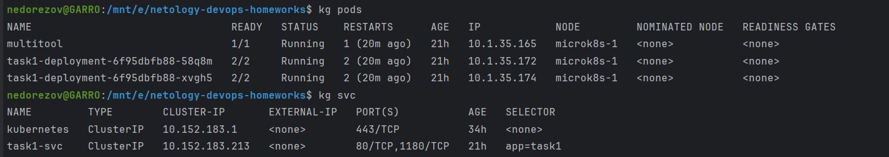
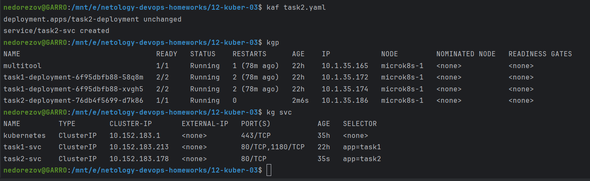

# Домашнее задание к занятию «Запуск приложений в K8S»
## Студент: Александр Недорезов

### Цель задания

В тестовой среде для работы с Kubernetes, установленной в предыдущем ДЗ, необходимо развернуть Deployment с приложением, состоящим из нескольких контейнеров, и масштабировать его.

------

<details>
<summary>Чеклист готовности к домашнему заданию</summary>

1. Установленное k8s-решение (например, MicroK8S).
2. Установленный локальный kubectl.
3. Редактор YAML-файлов с подключенным Git-репозиторием.

</details>

------

<details>
<summary>Инструменты и дополнительные материалы, которые пригодятся для выполнения задания</summary>

1. [Описание](https://kubernetes.io/docs/concepts/workloads/controllers/deployment/) Deployment и примеры манифестов.
2. [Описание](https://kubernetes.io/docs/concepts/workloads/pods/init-containers/) Init-контейнеров.
3. [Описание](https://github.com/wbitt/Network-MultiTool) Multitool.

</details>

------

### Задание 1. Создать Deployment и обеспечить доступ к репликам приложения из другого Pod

> 1. Создать Deployment приложения, состоящего из двух контейнеров — nginx и multitool. Решить возникшую ошибку.
> 2. После запуска увеличить количество реплик работающего приложения до 2.
> 3. Продемонстрировать количество подов до и после масштабирования.
> 4. Создать Service, который обеспечит доступ до реплик приложений из п.1.
> 5. Создать отдельный Pod с приложением multitool и убедиться с помощью `curl`, что из пода есть доступ до приложений из п.1.

### Решение:

Манифест: [task1.yaml](task1.yaml)

1. Создал Deployment приложения из двух контейнеров, при запуске один из контейнеров уходил в CrashLoop.  
Проверил логи проблемного контейнера, оказалось, что оба пытаются занять порт 80 на прослушивание. 

Чтобы исправить ошибку, добавил в `env` контейнера `multitool` значение `HTTP_PORT=1180`
Успешно запущенный deployment:

2. Увеличил количество реплик до 2, список подов:

3. В манифест добавил service и отдельный под с `multitool` для проверки:

4. С помощью `curl` проверил доступ к приложениям через сервис:


------

### Задание 2. Создать Deployment и обеспечить старт основного контейнера при выполнении условий

> 1. Создать Deployment приложения nginx и обеспечить старт контейнера только после того, как будет запущен сервис этого приложения.
> 2. Убедиться, что nginx не стартует. В качестве Init-контейнера взять busybox.
> 3. Создать и запустить Service. Убедиться, что Init запустился.
> 4. Продемонстрировать состояние пода до и после запуска сервиса.

### Решение:

Манифест: [task2.yaml](task2.yaml)

1. Создал Deployment с init container, который ждет запуск сервиса, выполняя команду ```until nslookup task2-svc; do echo waiting for service; sleep 2; done```.  
Применил конфигурацию, можно наблюдать, что pod в статусе Init

2. Добавил service в манифест, применил. Init отработал, приложение запустилось.
Действия и состояние пода:


------

### Правила приема работы

1. Домашняя работа оформляется в своем Git-репозитории в файле README.md. Выполненное домашнее задание пришлите ссылкой на .md-файл в вашем репозитории.
2. Файл README.md должен содержать скриншоты вывода необходимых команд `kubectl` и скриншоты результатов.
3. Репозиторий должен содержать файлы манифестов и ссылки на них в файле README.md.

------