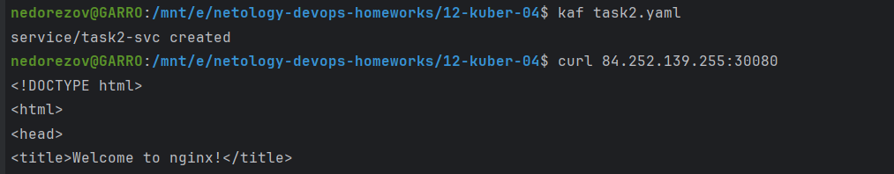

# Домашнее задание к занятию «Сетевое взаимодействие в K8S. Часть 1»

### Цель задания

В тестовой среде Kubernetes необходимо обеспечить доступ к приложению, установленному в предыдущем ДЗ и состоящему из двух контейнеров, по разным портам в разные контейнеры как внутри кластера, так и снаружи.

------

Инструменты и дополнительные материалы, которые пригодятся для выполнения задания

1. [Описание](https://kubernetes.io/docs/concepts/workloads/controllers/deployment/) Deployment и примеры манифестов.
2. [Описание](https://kubernetes.io/docs/concepts/services-networking/service/) Описание Service.
3. [Описание](https://github.com/wbitt/Network-MultiTool) Multitool.

------

### Задание 1. Создать Deployment и обеспечить доступ к контейнерам приложения по разным портам из другого Pod внутри кластера

> 1. Создать Deployment приложения, состоящего из двух контейнеров (nginx и multitool), с количеством реплик 3 шт.
> 2. Создать Service, который обеспечит доступ внутри кластера до контейнеров приложения из п.1 по порту 9001 — nginx 80, по 9002 — multitool 8080.
> 3. Создать отдельный Pod с приложением multitool и убедиться с помощью `curl`, что из пода есть доступ до приложения из п.1 по разным портам в разные контейнеры.
> 4. Продемонстрировать доступ с помощью `curl` по доменному имени сервиса.
> 5. Предоставить манифесты Deployment и Service в решении, а также скриншоты или вывод команды п.4.

### Решение:

Манифест: [task1.yaml](task1.yaml)

1. Создал Deployment приложения из двух контейнеров с 3 репликами и Service для доступа к нему по портам 9001 и 9002.

2. С помощью отдельного пода с multitool проверил доступ к приложению:

3. Проверил доступность по доменному имени, также видно, что Service распределяет трафик по репликам:

------

### Задание 2. Создать Service и обеспечить доступ к приложениям снаружи кластера

> 1. Создать отдельный Service приложения из Задания 1 с возможностью доступа снаружи кластера к nginx, используя тип NodePort.
> 2. Продемонстрировать доступ с помощью браузера или `curl` с локального компьютера.
> 3. Предоставить манифест и Service в решении, а также скриншоты или вывод команды п.2.

### Решение:

Манифест: [task2.yaml](task2.yaml)

Создал Service с типом NodePort, указал порт 30080. Проверил доступ через браузер:

------

### Правила приёма работы

1. Домашняя работа оформляется в своем Git-репозитории в файле README.md. Выполненное домашнее задание пришлите ссылкой на .md-файл в вашем репозитории.
2. Файл README.md должен содержать скриншоты вывода необходимых команд `kubectl` и скриншоты результатов.
3. Репозиторий должен содержать тексты манифестов или ссылки на них в файле README.md.
